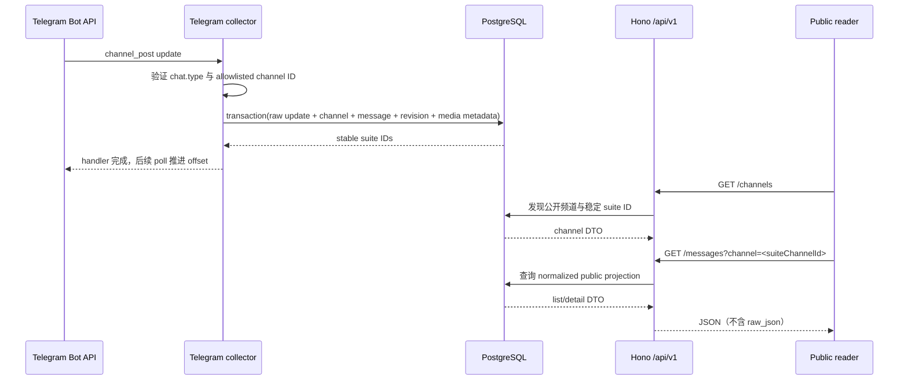

# G1.2 — 打通首条频道消息

> GitHub Issue: [#4](https://github.com/cosZone/koharu-suite/issues/4) ｜ 状态：Approved

## 背景与现状

G1.1 已建立 Hono、`kodama`、PostgreSQL 18、Drizzle migration、Testcontainers、Docker 和 CI
骨架，但当前 API 只有 health endpoint（`apps/server/src/app.ts:16`），数据库只有
`app_metadata`（`apps/server/src/db/schema.ts:3`），`kodama serve` 也只管理 HTTP server
（`apps/server/src/cli.ts:71`）。本 Goal 要把一条真实公开频道消息从 Telegram 一直送到公开
JSON API，形成后续 owner GUI、多频道可靠采集和 Astro adapter 可以复用的最小数据面。

Telegram `getUpdates` 最多保留 24 小时未取更新，offset 高于某个 `update_id` 时即确认此前更新；
因此 G1.2 使用顺序处理、单事务写入和数据库唯一约束实现可重放，而不在本阶段引入并发 runner
或自建任务队列。

## 目标

- `kodama serve` 同进程运行 Hono 与 grammY 内置顺序 long polling。
- 只接收并归档配置的单个公开频道 `channel_post`。
- 在一个 PostgreSQL 事务中保存 raw update、频道、消息和首个 normalized revision。
- 同一 Telegram update 或频道消息重复投递时，公开资源和 revision 数量保持不变。
- 用稳定 suite ID 提供公开频道发现、消息列表与详情。
- 保存常见媒体元数据，但不下载媒体文件。

## 约束与已确认合同

- PostgreSQL、Drizzle ORM、Hono、Zod 4、Node.js 22 和单一 `kodama` CLI 延续 G1.1。
- 环境变量使用 `TELEGRAM_BOT_TOKEN` 与 `TELEGRAM_CHANNEL_ID`；后者是唯一允许归档的 Telegram
  数字 channel ID。
- `GET /api/v1/channels` 返回已归档频道的稳定 suite channel ID、标题和可选 username；不暴露
  Telegram 数字 channel ID。
- `GET /api/v1/messages?channel=<suiteChannelId>` 中 `channel` 是稳定 suite channel ID；
  Telegram `@username` 只是可变展示字段。
- `GET /api/v1/messages/:id` 中 `id` 是稳定 suite message ID，不暴露 Telegram 复合键。
- `raw_json` 只进入数据库；公开 DTO 不包含 raw update、Telegram update ID 或 Bot token。
- G1.2 只处理 `channel_post`。编辑、删除、offset 持久化、多频道 allowlist、任务队列和跨频道并发
  由 G1.4 负责。
- M1 只保存媒体元数据，不调用 `getFile`、不下载或代理文件。

## 详细设计

### 运行时与模块边界

`kodama serve` 组装一个 PostgreSQL client、message repository、Hono app 和 Telegram collector。
collector 只负责过滤与规范化；repository 独占事务、幂等约束和查询；公开 route 只依赖窄的
read interface。测试可直接注入 repository 或真实 PostgreSQL，不需要访问 Telegram。



HTTP server 与 Bot 都必须响应 SIGINT/SIGTERM。停止顺序为：停止 long polling 并等待当前顺序
handler 完成，再关闭 HTTP listener，最后关闭 PostgreSQL client。启动失败时按相反方向释放已创建
资源，避免半启动进程。

### 数据模型

所有 suite 资源使用 PostgreSQL `uuid` + `gen_random_uuid()`。Telegram chat ID、update ID 和
message ID 使用 `bigint`，避免 JavaScript 或数据库侧截断。

| 表 | 关键字段与约束 | 用途 |
| --- | --- | --- |
| `telegram_channels` | `id`; unique `telegram_chat_id`; mutable `username`, `title` | 稳定频道资源 |
| `telegram_updates` | unique `telegram_update_id`; `channel_id`; `raw_json`; `received_at` | 幂等入口和原始证据 |
| `messages` | `id`; `channel_id`; `telegram_message_id`; unique `(channel_id, telegram_message_id)` | 稳定消息身份 |
| `message_revisions` | `id`; `message_id`; unique `telegram_update_id`; `revision_number=1`; normalized fields | 首个不可变快照 |
| `message_media` | `id`; `revision_id`; `position`; kind/file metadata | 不含文件内容的媒体描述 |

数据库事务先尝试登记 `telegram_updates`。若同一 update 已存在，返回既有消息；若新的 update 指向
已存在频道消息，则同样返回既有消息且不新增 revision。这样覆盖“提交成功但 offset 尚未确认”后的
重放。

首版 normalized revision 包含：

- `text`：优先 `message.text`，否则 `message.caption`，均无则为 `null`；
- 对应的 `entities` 或 `caption_entities`；
- `published_at`、`author_signature`、`media_group_id`；
- 常见 `photo`、`video`、`animation`、`audio`、`document`、`voice` 的 `file_id`、
  `file_unique_id`、MIME、文件大小、尺寸、时长和文件名等已有字段。

未知或新增 Telegram 字段继续保留在 raw JSON，不阻断已知字段归档。

### 公开 API

`GET /api/v1/channels`：

- 返回所有已归档频道的稳定 suite ID、标题和可选 username；
- 按标题和 suite ID 稳定排序；
- 即使暂无频道也返回 `200` 与 `{ "items": [] }`；
- 不返回 Telegram 数字 channel ID 或其他采集侧字段。

`GET /api/v1/messages?channel=<suiteChannelId>`：

- `channel` 必填且必须是 UUID；缺失或非法时返回 `400`；
- 未知频道返回 `404`；
- 返回最多 50 条，按 `publishedAt DESC, id DESC` 稳定排序；
- cursor pagination 延后至 G1.5。

`GET /api/v1/messages/:id`：

- 非 UUID 返回 `400`；
- 未知消息返回 `404`；
- 返回频道展示信息、当前 revision 和媒体元数据。

列表和详情共享同一 public projection，字段使用 camelCase。错误响应固定为
`{ "error": { "code": string, "message": string } }`。

### 配置与安全

- `TELEGRAM_BOT_TOKEN` 必填、trim 后非空；只传给 grammY，不进入日志、异常文本或数据库。
- `TELEGRAM_CHANNEL_ID` 解析为 Telegram 允许范围内的整数，并在进入规范化前精确比较。
- 即使 `allowed_updates` 变更前积压了其他 update，应用层过滤仍是最终安全边界。
- 公开 API 只从显式 public projection 序列化，不能直接返回 Drizzle row 或 `raw_json`。

## 备选方案与权衡

| 方案 | 优点 | 代价 / 风险 | 结论 |
| --- | --- | --- | --- |
| 内置顺序 long polling + 同进程 Hono | 语义简单；handler 完成后才推进；符合 G1.2 单频道吞吐 | 慢 handler 会阻塞后续 update；server/collector 暂时耦合部署 | 采用；G1.4/G1.6 再拆并发与 worker |
| `@grammyjs/runner` 并发处理 | 吞吐高，不同频道互不阻塞 | 崩溃时 offset 与未完成 handler 的可靠性需要 durable queue；超出 G1.2 | 不采用 |
| Webhook | 可由 Telegram 主动投递 | 需要公网 HTTPS、secret 和重试入口；本地部署复杂 | 不采用 |
| 用 Telegram `@username` 或复合键作为公开 ID | 人类可读，少一层 ID | 改名会漂移；泄露上游身份结构，限制未来导入来源 | 不采用 |
| 只存当前消息，不存 revision | schema 更小 | 无法平滑支持 G1.4 编辑历史，也丢失不可变来源快照 | 不采用 |

若未来单个频道的顺序处理已无法满足明确吞吐指标，推荐会改为 PostgreSQL durable job 后的
跨频道并发，而不是直接换并发 runner。

## 横切关注点与风险

- **隐私**：只接受显式允许的公开频道；raw JSON 不公开；token 不落库。
- **可靠性**：数据库唯一约束是最终幂等边界，不能只靠进程内记忆。
- **可观测性**：记录启动/停止、被忽略 update 类型、归档成功和可脱敏错误；不记录整包 update。
- **性能**：G1.2 列表固定最多 50 条；为频道 + 发布时间排序建立索引。
- **兼容性**：Telegram 新字段保留在 raw JSON；normalized parser 只读取认识的字段。
- **主要风险**：运行时资源释放、BigInt/JSON 边界、Drizzle transaction 类型和媒体多态；分别由
  lifecycle 单测、字符串化 DTO、PostgreSQL 集成测试和 fixture matrix 缓解。

## 上线、迁移与回滚

1. 用 `drizzle-kit generate` 生成并提交新 migration。
2. 部署前运行 `kodama migrate`；迁移只新增表/索引，不改写 G1.1 数据。
3. 配置 Bot token 和唯一 channel ID，把 Bot 设为该公开频道管理员，再启动 `kodama serve`。
4. 发一条测试消息，30 秒内先从频道发现 API 取得 suite channel ID，再从列表和详情 API 读回并
   核对不含 raw 数据。

代码回滚可以停用新版进程并恢复旧镜像；新增表保留不会影响 G1.1。数据库结构回滚默认不自动
DROP，确需清理时先导出 raw update 与 normalized 数据，再由人工确认执行反向 SQL。

## 测试与验收

- parser 单测：纯文本、caption、entities、媒体 metadata、未知字段。
- collector 单测：错误 chat type、错误 channel ID、重复 update。
- lifecycle 单测：启动失败、SIGINT/SIGTERM、Bot 与 HTTP/DB 释放顺序。
- PostgreSQL 18 集成测试：migration 幂等、并发/重复灌入、稳定 suite ID、revision 数量不变。
- Hono 集成测试：真实 repository 上的 channel discovery、400/404/list/detail、排序与 public
  projection。
- Docker/Compose 与 CI 延续 G1.1。
- 手动 Telegram smoke 需要用户在本地安全配置真实 token 与 channel ID；secret 不进入提交或
  Issue/PR。

验证命令：

```bash
pnpm lint
pnpm typecheck
pnpm test
pnpm test:integration
pnpm build
pnpm exec kodama --help
docker compose config
docker build .
```

## 文档影响

- README / README.en 增加 Bot 创建、频道管理员权限、单频道配置、频道发现和公开 API quick
  start。
- `.env.example` 增加无真实 secret 的 Telegram 配置占位。
- API 示例只使用 suite ID。
- 后续 Astro 集成测试不得在 astro-koharu 的开发主仓库执行；必须从其 template 创建隔离测试
  仓库。文章样本可从本地 private checkout 复制到临时 fixture，但不得把私有内容推送到公开远端。

## 明确不做

- `edited_channel_post`、删除检测、offset 持久化、任务队列和跨频道并发。
- 多频道数据库 allowlist、频道启停与 GUI 配置。
- Better Auth、owner、session、service token 和 raw update 管理界面。
- cursor pagination、搜索、RSS、媒体下载、缩略图或 storage adapter。
- 讨论区评论、私有频道、MTProto 用户会话。
- Astro adapter 或跨仓库集成实现。

## 待决问题

没有阻塞 G1.2 开工的待决产品合同。真实 Telegram smoke 前需要用户在本地提供
`TELEGRAM_BOT_TOKEN` 与 `TELEGRAM_CHANNEL_ID`，但不会在对话、Git 或日志中传递 secret。

## 参考

- [Roadmap #1](https://github.com/cosZone/koharu-suite/issues/1)
- [G1.2 Issue #4](https://github.com/cosZone/koharu-suite/issues/4)
- [Telegram Bot API — Getting updates](https://core.telegram.org/bots/api#getting-updates)
- [grammY — Long Polling](https://grammy.dev/guide/deployment-types#long-polling)
- `docs/goals/G1.1-runnable-workspace.md`
