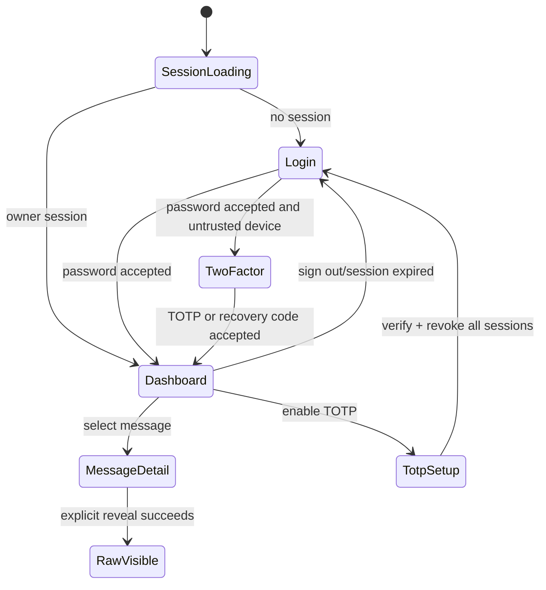

# G1.3 — 交付 owner GUI

> GitHub Issue: [#6](https://github.com/cosZone/koharu-suite/issues/6) ｜ 日期：2026-07-24 ｜ 状态：Approved

## 1. 背景与问题

G1.2 已把 Telegram 消息送到 PostgreSQL 与公开 API，但当前 Hono app 只有公开 health/channel/message
路由（`apps/server/src/app.ts:46`），CLI 只有 `serve` 与 `migrate`（`apps/server/src/cli.ts:11`），
数据库没有身份或 owner 模型（`apps/server/src/db/schema.ts:16`）。Admin 仍是只读 health 壳
（`apps/admin/src/App.tsx:14`），Docker 也只复制并构建 server（`Dockerfile:12`）。

G1.3 要形成第一个受保护的 owner 操作面，同时保持 koharu-suite 的公开内容 API 可独立使用。安全
边界不是“只要能登录”，而是数据库中只有一个 owner、HTTP 永远不能公开注册、raw update 只能由
该 owner 主动获取、凭据变化能撤销已有 session，并且 Admin 与 API 同源避免跨域 cookie。

Better Auth 1.6.x 官方支持 Hono handler、Drizzle PostgreSQL adapter、7 天 session、email/password
关闭 sign-up、TOTP 与加密 backup codes。本项目继续让 Drizzle migration 成为唯一 schema 迁移
来源，不在运行时执行 Better Auth migration。

## 2. 目标与非目标

### Goals

- 原子创建且只能创建一个 owner；本机 CLI 可安全重置其密码。
- 通过 Better Auth 邮箱密码 session 保护管理 API 与 Admin。
- 提供可选 TOTP、一次性 recovery codes 和凭据变化后的全 session 撤销。
- 同源 `/admin/` 完成登录、状态、频道/消息浏览、显式 raw reveal 和退出。
- raw response 只由独立 owner endpoint 返回，禁止缓存和预取。
- PostgreSQL 18 migration、自动测试、Docker production build 与真实浏览器 smoke 可重复验证。

### Non-Goals

- 多 owner、注册、邀请、邮件系统、OAuth、magic link、passkey、SSO、RBAC 或 service token。
- Admin 中编辑消息、频道配置、采集控制、重试、搜索、分页或媒体代理。
- 跨域/跨子域 Admin，或在 G1.3 引入第二个前端框架、router、组件库。
- Astro adapter、发布或 Agent 能力。

## 3. 约束与假设

- 已确认：唯一 owner；只由 CLI 创建/重置；公开注册关闭；TOTP 可选；recovery codes 无短信/邮件
  fallback；7 天 session、无 remember-me；凭据变化撤销全部 session；raw 只主动 reveal 且
  `no-store`。
- Node 22、Hono、React 19、Vite 8、PostgreSQL 18、Drizzle ORM 延续 G1.2。
- `BETTER_AUTH_SECRET` 至少 32 字符，`BETTER_AUTH_URL` 是 Admin 与 API 的 canonical same-origin
  URL。localhost HTTP 是唯一非 Secure-cookie 例外。
- Better Auth 官方 Drizzle schema 会被显式映射到 `auth_*` 表；schema 生成物先用于核对字段，
  最终仍由 `drizzle-kit generate` 产生本仓库 migration。
- G1.3 单实例 server 已足够；多 worker、service token 和全局限流属于后续 Goal。
- 已确认允许用户在 TOTP challenge 中显式信任当前设备 30 天；未勾选时不写 trusted-device
  cookie。该 cookie 只跳过第二因子，不能在没有正确邮箱密码时建立 session。

## 4. 方案设计

### 4.1 模块边界

- `auth/config`：从已校验配置构造 runtime auth；runtime 永远 `disableSignUp: true`。
- `auth/runtime-auth`：包装 Better Auth handler；密码或 TOTP 状态成功变化后由 server 强制删除该
  user 的全部 session，不信任客户端传入的撤销选项。
- `auth/owner-service`：只供 CLI 使用；在同一数据库 transaction 与 advisory lock 中创建 auth
  user 和 singleton owner，或执行 token-based password reset。
- `auth/owner-session`：从 request headers 解析 Better Auth session，并核对 singleton owner ID。
- `admin/repository`：状态计数与 raw update 查询；不把 Drizzle row 直接交给 HTTP。
- Hono：先注册 `/api/auth/*` 和 `/api/v1/admin/*`，再注册公开 API，最后注册 `/admin/*` 静态文件。
- React Admin：单页状态机；不引入 router。所有受保护内容只有 session 成功后才加载。

### 4.2 数据模型

Better Auth adapter 使用逻辑 model keys `user`、`session`、`account`、`verification`、
`twoFactor`，底层表显式命名：

| 表 | 关键约束 | 用途 |
| --- | --- | --- |
| `auth_users` | text ID PK、unique email、`two_factor_enabled` | owner identity |
| `auth_sessions` | text ID/token、unique token、user FK、expires、IP/UA | authoritative 7-day session |
| `auth_accounts` | provider/account unique、user FK、hashed credential | email password account |
| `auth_verifications` | identifier/value/expiry | one-time password reset / 2FA challenge |
| `auth_two_factors` | user FK、encrypted secret/codes、verification lock fields | TOTP |
| `owners` | `singleton=1` PK + check、unique user FK | database-level only-owner authority |

owner 创建 transaction：

1. `pg_advisory_xact_lock` 固定 key；
2. 检查 `owners.singleton=1`；
3. 在同一 Drizzle transaction 上构造 CLI-only Better Auth（临时允许 direct `signUpEmail`，
   `autoSignIn: false`）；
4. 创建 auth user/account；
5. 插入 singleton owner；任一步失败整体回滚。

runtime auth 从不使用 CLI-only 配置，因此 `/api/auth/sign-up/email` 固定拒绝。

密码重置使用 Better Auth 的一次性 reset token 流程：CLI-only `sendResetPassword` callback 在内存
捕获 token，不发送、不输出，随后调用 reset endpoint。`revokeSessionsOnPasswordReset: true` 保证
所有旧 session 失效。

### 4.3 配置与 session

- `BETTER_AUTH_SECRET`：trim 后至少 32 字符；只进入 Better Auth 与错误脱敏列表。
- `BETTER_AUTH_URL`：只允许 `http://localhost` / `http://127.0.0.1` 或 HTTPS absolute URL；
  trusted origin 精确等于其 origin。
- session：`expiresIn=604800`，`updateAge=86400`，数据库 authoritative；Admin 不展示
  remember-me 选项，并固定使用 7 天滑动 session。
- CSRF/origin checks 保持启用；不启用 cross-subdomain cookies。
- 生产 URL 使用 Secure/HttpOnly/SameSite=Lax cookie；登录和 two-factor route 使用 Better Auth
  rate limit。
- TOTP secret 与 recovery codes 使用 Better Auth 默认加密存储；不返回数据库字段。
- TOTP challenge 提供显式的“信任此设备 30 天”，对应 `trustDeviceMaxAge=2592000`；默认不勾选。
  trusted-device cookie 继承 HttpOnly/Secure/SameSite 属性，只在密码登录成功后跳过 TOTP。
- TOTP enable/disable 成功后 server wrapper 删除该 user 的全部 session；当前页面回到登录。
- Better Auth 的认证后 `change-password` endpoint 即使未在 GUI 暴露，也在成功响应后强制删除
  该 user 的全部 session。

### 4.4 HTTP 合同

`GET|POST /api/auth/*` 直接交给 Better Auth handler。

`GET /api/v1/admin/status`：

- 无 session：`401 { error: { code: "unauthorized", ... } }`；
- session user 不是 singleton owner：`403 owner_required`；
- 成功：owner email、server version、频道/消息/update 计数与 collector 状态；不含 secret。

`GET /api/v1/admin/messages/:id/raw`：

- 非法 suite message UUID 为 `400`；未知为 `404`；
- auth 语义同 status；
- 返回当前 revision 对应 `{ update: rawJson }`；
- `Cache-Control: private, no-store`，并设置 `Vary: Cookie`；
- public list/detail 不增加 raw URL 或 raw payload，Admin 只在按钮点击时 fetch。

### 4.5 Admin 状态机



Dashboard 先加载受保护 status，再复用公开 `/channels` 与 `/messages`。未认证时不请求消息；详情默认
只显示 public DTO。Raw button 的 loading/error/result state 独立，页面切换时销毁 raw state。

Vite `base` 为 `/admin/`；开发继续由 Vite proxy `/api`。production Docker build 同时构建 Admin，
将产物复制到 runtime image，Hono `serveStatic` 使用 absolute path 并在 `/admin` 重定向到
`/admin/`。

### 4.6 CLI

```text
kodama owner create --email owner@example.com [--password-stdin]
kodama owner reset-password --email owner@example.com [--password-stdin]
```

TTY 默认以隐藏输入读取并要求二次确认。非 TTY 必须显式 `--password-stdin`，从 stdin 读取一次，
绝不接受 `--password` argv。密码为 12–128 字符；错误不回显密码、auth secret 或 database URL。

## 5. 备选方案与权衡

| 方案 | 优点 | 代价 / 风险 | 结论 |
| --- | --- | --- | --- |
| Better Auth runtime + CLI-only factory + singleton owner | 使用受支持 auth flow；runtime 无 bootstrap route；数据库约束明确 | auth factory 与 transaction 需要集成测试；升级时核对 schema | 采用 |
| 首次访问 GUI + bootstrap token | 部署体验直观 | 新增远程 bootstrap 攻击面、token 生命周期与重放处理 | 不采用 |
| 直接 SQL 写 Better Auth password/account | CLI 依赖少 | 绑定内部 hash/schema，升级脆弱，容易漏 session revoke | 不采用 |
| Admin plugin 暴露 create/reset API | 官方接口完整 | 扩大 runtime RBAC/管理 route 与 schema，不符合唯一 owner | 不采用 |
| JWT/stateless session | 少一次 DB 查询 | 凭据变化后难以立即撤销全部 session | 不采用 |
| raw 嵌入管理消息详情 | 少一次请求 | 容易预取、缓存、日志与前端状态泄漏 | 不采用 |

若未来出现多 owner/RBAC 或 service token，才重新评估 Better Auth admin/plugin；G1.3 不预埋远程
user management。

## 6. 横切关注点

- 安全：数据库 singleton + runtime sign-up disabled 双边界；exact origin；CSRF 开启；secret 脱敏；
  raw no-store；密码不进 argv；登录与 2FA rate limit。
- 隐私：Admin 列表只用 public DTO；raw 仅点击后请求，不持久化到 localStorage/sessionStorage。
- 性能：status 使用独立 count 查询；列表仍最多 50 条。Admin 静态 asset 使用 hashed filename
  长缓存，`index.html` no-cache。
- 可观测性：记录 owner create/reset 成功、登录失败类别与 session revoke 数量，但不记录 email
  以外的 credential、TOTP、recovery code、cookie 或 raw JSON。
- 可访问性：所有表单有 label、错误关联与 focus；按钮支持键盘；颜色不是唯一状态表达。

## 7. 影响与风险

- auth schema 与 Better Auth minor 版本必须锁定；migration snapshot 是升级审查边界。
- owner create 跨 Better Auth 与 singleton row 的原子性是最高风险，由并发 PG18 测试证明。
- TOTP enable 后全 session 撤销会让当前页面立刻退出，这是已确认安全语义，UI 必须先提示。
- Docker 从 server-only 变为 server + Admin artifact，需验证 non-root runtime 可读取静态文件。
- 同一 `.env` 现在同时包含 Telegram 与 auth secret；文档必须明确权限和备份要求。

## 8. 上线、迁移与回滚

1. 生成 auth secret 并配置 canonical HTTPS URL。
2. 部署新镜像但先运行 `kodama migrate`。
3. 通过本机或 `docker compose run --rm server` 交互创建 owner。
4. 启动 server，完成登录、raw reveal、TOTP/recovery smoke。

代码回滚到 G1.2 后 auth 表保留但不被读取。默认不自动 DROP auth/owner 表；若必须清理，先撤销
session、导出 owner email 与 auth schema 备份，再经人工确认执行反向 SQL。恢复旧镜像不会影响
公开 API 与 Telegram 数据。

## 9. 测试策略

- config 单测：secret 长度、URL/origin、localhost/HTTPS、脱敏。
- CLI 单测：命令解析、TTY/`--password-stdin`、确认不匹配、重复 create、reset。
- auth/Hono 单测：sign-up disabled、401/403、raw 400/404/no-store、public DTO 无 raw。
- PostgreSQL 18：migration 幂等、并发 owner create 唯一且无孤儿、登录/session、password reset
  revoke、TOTP schema/backup code secrecy、raw 与 revision 关联。
- Admin build；浏览器 smoke：匿名重定向/login、TOTP challenge/recovery、状态/消息、raw 仅点击
  后请求、logout、移动宽度。
- Docker：Admin 静态文件、hashed asset、non-root、migration + owner CLI + server。

## 10. 待决问题

没有阻塞 G1.3 开工的产品或安全合同。

## 11. 参考

- [Roadmap #1](https://github.com/cosZone/koharu-suite/issues/1)
- [G1.3 #6](https://github.com/cosZone/koharu-suite/issues/6)
- [Better Auth Hono integration](https://better-auth.com/docs/integrations/hono)
- [Better Auth Drizzle adapter](https://better-auth.com/docs/adapters/drizzle)
- [Better Auth email/password](https://better-auth.com/docs/authentication/email-password)
- [Better Auth two-factor plugin](https://better-auth.com/docs/plugins/2fa)
- [Hono Node.js static files](https://hono.dev/docs/getting-started/nodejs)
- `docs/goals/G1.2-first-channel-message.md`
