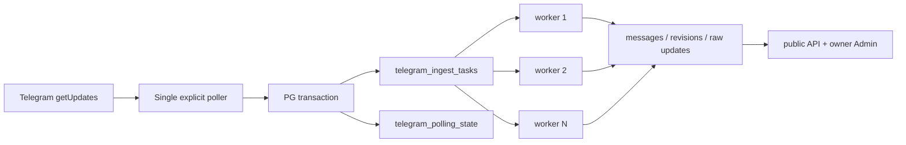

# G1.4 — 扩展为多频道可靠采集

> GitHub Issue: [#8](https://github.com/cosZone/koharu-suite/issues/8) ｜ 日期：2026-07-24 ｜ 状态：Approved

## 1. 背景与问题

G1.2 使用 grammY 内置顺序 `bot.start()`，每次只请求一个 `channel_post`，在 handler 的
PostgreSQL transaction 完成后由 grammY 推进 offset。这能证明单频道纵向闭环，但不能让多个频道
并行，也没有独立保存 Bot offset 或未处理任务。

Telegram update 是 Bot 级全局流。`getUpdates(offset)` 一旦携带高于某 update ID 的 offset，
Telegram 就认为之前 update 已确认，并且未获取 update 最多保留 24 小时。直接换成
`@grammyjs/runner` 会让下一轮 polling 与当前 handler 并行；grammY 官方明确说明 hard crash 时
可能丢失最多一批已提前确认但未完成的 update。

G1.4 必须先把允许频道的 update 与下一 cursor 原子写入 PostgreSQL，再让独立 worker 并发处理。
这样 Telegram acknowledgement 与业务处理解耦：上游只在 durable inbox 成功后推进，worker 则以
at-least-once + domain idempotency 处理任务。

## 2. 目标与非目标

### Goals

- 一个 Bot token 统一消费多个公开频道的全局 update stream。
- 数据库 allowlist default-deny，allowlist 外 raw payload 不落库。
- update 与 Bot cursor 在同一个 PostgreSQL transaction 中持久化。
- 同频道严格顺序，不同频道有界并发。
- `edited_channel_post` 形成不可变 revision 历史并切换 current revision。
- polling、worker、process 或 DB crash 后可恢复，不丢已 durable 接收的 update。
- 明确 Telegram 24 小时上游 retention 仍是不可消除的边界。

### Non-Goals

- 多 Bot、webhook、私有频道、MTProto、删除/reconcile、评论。
- 通用任务队列框架、独立 worker 容器或多节点扩缩容。
- owner 远程 retry/skip、频道 disable 或 GUI 配置。
- 媒体下载、搜索、RSS、Astro adapter。

## 3. 已确认合同

- Node.js 22、TypeScript、Hono、grammY、Drizzle、PostgreSQL 18 和单一 `kodama` CLI。
- 一个 Bot token 支持多个公开频道；不能同时运行第二个 `getUpdates` consumer。
- PostgreSQL 是唯一 durable state；Drizzle-generated SQL 是唯一 schema migration 来源。
- allowlist 以数据库为准，由 `kodama channel add/list` 管理；添加时验证公开频道与 Bot 管理员
  身份。旧 `TELEGRAM_CHANNEL_ID` 只在 allowlist 为空时自动导入一次。
- poison update 有限指数重试后阻塞该频道，不自动越过；其他频道继续。owner retry/skip 延至
  G1.5。
- 收到 edit 但没有原消息时，以 first-known snapshot 创建 revision 1；每个不同 Telegram edit
  update 都保留 revision，即使 normalized 内容相同。
- raw JSON 只对 singleton owner 的显式 no-store endpoint 可见。
- M1 只保存媒体 metadata。

## 4. 候选方案

| 方案 | 优点 | 风险 / 代价 | 结论 |
| --- | --- | --- | --- |
| grammY runner + `sequentialize(chatId)` | API 成熟；跨 chat 并发简单 | 进程内、非 durable；可能提前确认最多一批 update | 不采用 |
| 显式 poller + PostgreSQL inbox + 自有 worker | cursor/inbox 可原子提交；schema 和顺序规则完全可验证；无新依赖 | 要实现窄任务状态机和并发 SQL | 采用 |
| Graphile Worker | durable、重试、并发和 shutdown 已实现 | 自有 schema/migration；poison 顺序仍需二次建模；crash lock 恢复窗口长 | 不采用 |
| pg-boss | PostgreSQL queue、重试、transaction enqueue | 引入自有 schema/lifecycle；per-channel strict head 仍需额外约束 | 不采用 |
| webhook | Telegram 重试，易横向扩展 | 公网 HTTPS、secret、部署复杂度；不符合既定 long polling | 不采用 |

`cos-tool-bot` 的 `run(bot)` 解决的是最长数分钟 AI handler 阻塞其他交互命令的问题。它没有
durable inbox、cursor checkpoint 或 `sequentialize`；可借鉴 handle 的 start/stop 状态管理，不能
复用其接收可靠性模型。

## 5. 体系结构



### 5.1 Poller

启动步骤：

1. `Api.getMe()` 取得 Bot numeric ID，并核对 singleton polling state；数据库已绑定不同 Bot 时
   fail-fast；
2. dedicated PostgreSQL connection 申请 poller advisory lock；
3. 若 allowlist 为空且旧 `TELEGRAM_CHANNEL_ID` 存在，验证并一次性导入；
4. 读取 `telegram_polling_state.next_update_id`；
5. 使用 `Api.getUpdates({ offset, limit: 100, timeout: 30,
   allowed_updates: ['channel_post', 'edited_channel_post'] }, signal)`；
6. transaction 内查 allowlist，只插入允许频道的任务，并 upsert
   `next_update_id=max(update_id)+1`；
7. commit 后才发下一次更高 offset 的 `getUpdates`。

如果 DB transaction 失败，poller 不得继续发送更高 offset。Telegram 暂时失败使用带抖动指数
退避，但 worker 继续消费既有 inbox。

### 5.2 Worker pool

默认 4 个异步 worker loop，`TELEGRAM_WORKER_CONCURRENCY` 允许 1–16。每次 transaction 只
claim 一条任务：

```sql
WITH candidate AS (
  SELECT task.id
  FROM telegram_ingest_tasks task
  WHERE task.processed_at IS NULL
    AND task.blocked_at IS NULL
    AND task.available_at <= now()
    AND NOT EXISTS (
      SELECT 1
      FROM telegram_ingest_tasks earlier
      WHERE earlier.telegram_chat_id = task.telegram_chat_id
        AND earlier.telegram_update_id < task.telegram_update_id
        AND earlier.processed_at IS NULL
    )
  ORDER BY task.telegram_update_id
  FOR UPDATE SKIP LOCKED
  LIMIT 1
)
SELECT task.*
FROM telegram_ingest_tasks task
JOIN candidate ON candidate.id = task.id;
```

业务写入放在 nested Drizzle transaction/savepoint 中：

- 成功：插入或重放 domain update、message/revision/media，设置 task `processed_at` 并清空 task
  raw；
- 失败：回滚 savepoint，outer transaction 增加 attempt、保存脱敏且限长的 `last_error`，计算
  `available_at`；
- 达到 10 次失败后设置 `blocked_at`；退避从 1 秒指数增长，单次最多 5 分钟。

整个处理 transaction 持有 candidate row lock。连接或进程 crash 会让 PostgreSQL 自动回滚并释放
锁，不需要持久 `processing` 状态、lease 或 reaper。

### 5.3 已验证的 claim 不变量

2026-07-24 使用 `postgres:18-alpine` 临时容器验证：

- worker 1 在 transaction 中锁定频道 1 update 101；
- worker 2 并发 claim 选择频道 2 update 103；
- 101 保持未完成时，下一 claim 选择频道 2 update 104；
- 频道 1 update 102 没有越过 101。

这证明 `NOT EXISTS earlier unfinished` 与 `FOR UPDATE SKIP LOCKED` 的组合能表达本 Goal 的
head-of-line 合同。

## 6. 数据模型

### `telegram_polling_state`

| 字段 | 说明 |
| --- | --- |
| `singleton integer primary key check (=1)` | 数据库只绑定一个 Bot |
| `bot_id bigint unique` | `getMe().id`，token 不落库；不同 Bot fail-fast |
| `next_update_id bigint null` | 下一次 `getUpdates` offset |
| `updated_at timestamptz` | checkpoint 时间 |

### `telegram_channel_allowlist`

| 字段 | 说明 |
| --- | --- |
| `telegram_chat_id bigint primary key` | 负数 Telegram channel ID |
| `title text` | add 时 `getChat` 快照，仅 admin 使用 |
| `username varchar(64) null` | add 时必须存在；之后频道改名不影响 identity |
| `created_at/updated_at` | 配置时间 |

不直接把 `telegram_channels` 当 allowlist，避免“配置但还没有消息”的频道出现在公开 discovery。
migration 会把既有 `telegram_channels` 回填到 allowlist；空库才使用 legacy env bootstrap。

### `telegram_ingest_tasks`

| 字段 | 说明 |
| --- | --- |
| `id uuid primary key` | suite task identity |
| `bot_id bigint` | 已绑定 Bot 的 evidence |
| `telegram_update_id bigint unique` | durable dedupe |
| `telegram_chat_id bigint` | head-of-line key |
| `update_type varchar(32)` | `channel_post` / `edited_channel_post` |
| `raw_json jsonb null` | pending/retry/blocked evidence；成功后清空 |
| `attempt_count integer` | 失败次数 |
| `available_at timestamptz` | 下一次重试 |
| `processed_at timestamptz null` | 完成时间 |
| `blocked_at timestamptz null` | poison head |
| `last_error text null` | 脱敏、限长，不含 raw/token/DB URL |
| `created_at/updated_at` | 生命周期 |

索引包括 unique update ID、unfinished channel head 和 runnable task。成功后的完整 raw update 继续由
`telegram_updates` 保存，供 owner raw reveal。

`message_revisions` 增加可空 `edited_at`；`telegram_updates.update_type` 支持首发与编辑。

## 7. Revision 处理

共享 normalization 接受 `channel_post` 和 `edited_channel_post`，输出同一
`NormalizedChannelPost`，并携带 `updateType` 与 `editedAt`。

首发：

1. upsert channel display metadata；
2. insert `telegram_updates`；
3. insert message；
4. insert revision 1/media；
5. `current_revision_number=1`。

编辑：

1. dedupe `telegram_updates`；
2. `SELECT ... FOR UPDATE` message identity；
3. 若已存在，插 revision `current+1` 和 media，再更新 current；
4. 若不存在，以 first-known snapshot 创建 message + revision 1；
5. 同 update replay 返回现有 revision，不再递增。

不同 update ID 的 `edited_channel_post` 始终形成新 revision。重复的 `channel_post` 只保留 raw
evidence，不为同一 message identity 创建伪编辑。

public list/detail 与 admin raw repository 已按 `current_revision_number` join；编辑后自动展示最新
revision。

## 8. Allowlist CLI 与迁移

```text
kodama channel add --telegram-id -1001234567890
kodama channel list
```

`add` 需要 database URL 与 Bot token，调用 `getMe`、`getChat`、`getChatMember`：

- chat type 必须是 `channel`；
- username 必须存在（添加时是公开频道）；
- Bot member status 必须是 `administrator` 或 `creator`；
- 成功后 upsert allowlist，输出标题与 username，不输出 token。

`list` 只需 database URL。升级时 migration 先回填既有频道；如果仍为空且 legacy env 有值，
`serve` 在 polling 前验证并 bootstrap 一次。后续 allowlist 非空时 legacy env 不再改变数据库。

## 9. 生命周期与多实例

poller 使用 database advisory lock 保证同一 database 只有一个 ingress。第二实例无法取得锁时
fail-fast，以免两个 `getUpdates` consumer 互相确认 update。

停止顺序：

1. abort 当前 `getUpdates`；
2. 等待已开始的 ingress transaction；
3. worker pool 停止 claim 新任务；
4. 等待活动 worker transaction；
5. 关闭 HTTP；
6. 关闭 poller 与主数据库连接。

poller 的 `done` rejection 继续走现有 process lifecycle 脱敏路径。worker 单条失败只更新 task，
不终止全进程；poller lock/DB invariant 失败必须终止。

## 10. 失败矩阵

| 失败点 | 可观察结果 | 恢复 |
| --- | --- | --- |
| fetch 完成、inbox commit 前 crash | Telegram offset 未提高 | restart 重取 |
| inbox/cursor commit 后、下一 poll 前 crash | DB 已 durable | restart 用 cursor；重送由 unique 去重 |
| DB outage | ingress transaction 失败 | 不提高 offset；恢复后重试 |
| Telegram outage | 无新 batch | poller backoff；workers 清 backlog |
| worker transaction crash | 行锁与写入回滚 | 下一 worker 重新 claim |
| poison update | 同频道 blocked，其他频道继续 | G1.5 owner retry/skip |
| 离线超过 Telegram retention | 上游已删除 update | 无法由 Bot API 恢复；M2 import/reconcile |

## 11. Admin 与可观测性

Admin status 增加 configured/active channels、pending/retrying/blocked tasks 与 last checkpoint。不得
返回 raw、numeric chat ID、task error text 或 token。G1.4 只展示状态，不提供 mutation。

## 12. 测试策略

### Unit

- config：worker concurrency、legacy bootstrap、channel ID；
- normalization：post/edit、edit date、媒体；
- poller：batch offset、allowlist default-deny、abort、Telegram backoff；
- lifecycle：stop order；
- CLI：add/list validation 和 token/error 脱敏。

### PostgreSQL 18 integration

- migration 重入与 G1.2 channel backfill；
- inbox + cursor transaction rollback；
- duplicate batch；
- singleton Bot mismatch 与 poller advisory lock；
- 两频道 worker 并发；
- 同频道 head-of-line；
- savepoint error/backoff/blocked isolation；
- crash rollback/reclaim；
- first post + consecutive edits + duplicate edit；
- unknown edit first-known snapshot；
- public/Admin current revision/raw no-store。

### Runtime

- Docker non-root build；
- Compose migration/CLI/serve；
- 只在用户授权测试频道做 post/edit smoke；
- 第二频道并发仅用 fixture + PostgreSQL 18，不触碰用户要求不动的频道；
- stop/restart backlog drain；
- Admin 显示 task/channel counts。

## 13. 上线与回滚

1. 部署新镜像前运行 `kodama migrate`；
2. 通过 migration backfill、legacy bootstrap 或 `kodama channel add` 建 allowlist；
3. 停止所有旧 G1.3 collector，确认同 token 没有第二 consumer；
4. 启动新版并验证 checkpoint/task 状态；
5. 只在用户已授权的测试频道发 post/edit；
6. 用 fixture + PostgreSQL 18 证明第二频道并发；
7. 验证 revision 和公开 API。

回滚到 G1.3 前必须先停止新版 poller。旧版不知道 durable inbox/cursor，直接启动会重新依赖 grammY
内存 offset；因此默认只允许代码回滚用于停止服务或修复，不能在未评估 pending inbox 时恢复旧
collector。新增表不自动 DROP；先导出 cursor、pending/blocked raw 与 revision 证据。

## 14. 参考

- [Roadmap #1](https://github.com/cosZone/koharu-suite/issues/1)
- [G1.4 #8](https://github.com/cosZone/koharu-suite/issues/8)
- [G1.2 #4](https://github.com/cosZone/koharu-suite/issues/4)
- [Telegram Bot API](https://core.telegram.org/bots/api#getting-updates)
- [grammY runner reliability](https://grammy.dev/advanced/reliability#grammy-runner)
- [PostgreSQL 18 locking](https://www.postgresql.org/docs/18/sql-select.html)
- [Graphile Worker](https://worker.graphile.org/docs)
- `docs/goals/G1.2-first-channel-message.md`
