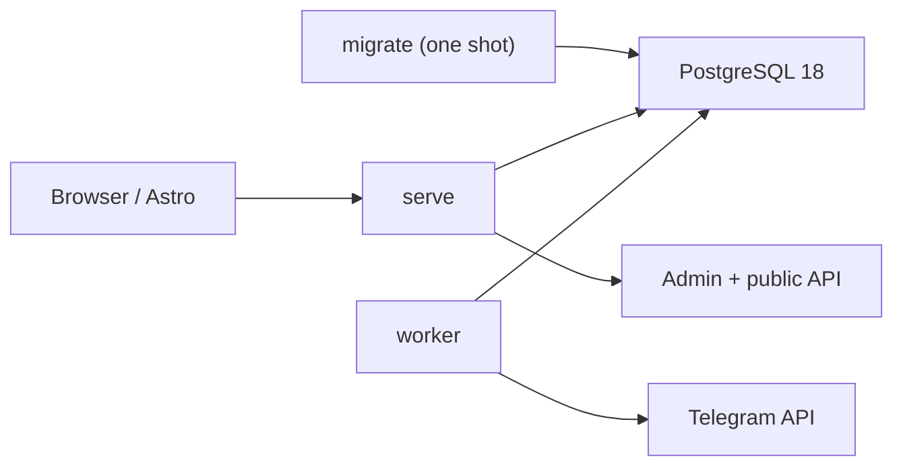

# G1.6 发布 Preview 设计文档

> 作者：Codex ｜ 日期：2026-07-24 ｜ 状态：Accepted

## 1. 背景与问题（Context）

G1.1–G1.5 已交付可运行 workspace、Telegram 消息入库、Owner Desk、多频道可靠采集与基础运维。
G1.6 要把这些能力收束成首个可部署、可验证、可发布的 `v0.1.0` Preview。

当前部署仍有四个缺口：

1. `serve` 同时创建 Better Auth、HTTP server、Telegram API、poller 和 task workers
   （`apps/server/src/runtime.ts:70`），因此 server 必须同时持有 Web 与 Bot 两类 secret。
2. ingestion 构造时先启动 workers、再启动 poller（`apps/server/src/telegram/ingestion.ts:13`），
   而 poller 的 advisory lock 是启动后异步取得；第二副本可能在确认自己不是 leader 前消费任务。
3. `/healthz` 只返回静态 liveness，Admin 的 collector 状态由进程内闭包硬编码为 `running`
   （`apps/server/src/app.ts:238`、`apps/server/src/runtime.ts:87`），拆分进程后会失真。
4. Compose 只有 `db` 与组合式 `server`（`compose.yaml:1`、`compose.yaml:22`），CI 仅验证
   `docker compose config` 与镜像构建（`.github/workflows/ci.yml:57`），没有可证明消息链路可用的 smoke。

发布工程也尚未建立：workspace 只包含 `apps/*`（`pnpm-workspace.yaml:1`），根 scripts 没有
Changesets、Storybook 或 Compose smoke（`package.json:7`），仓库没有 Preview release workflow。
Admin 已出现可复用的 Button、Badge、Panel、Field 等视觉原语，但样式仍是全局选择器
（`apps/admin/src/styles.css:1`、`apps/admin/src/styles.css:161`、`apps/admin/src/styles.css:208`），
不能直接作为将来 Astro 消费的安全边界。

## 2. 目标与非目标（Goals / Non-Goals）

### Goals

- 一个镜像提供 `kodama serve`、`kodama worker`、`kodama migrate` 三个独立入口。
- `serve` 不读取 `TELEGRAM_BOT_TOKEN`；`worker` 不读取 Better Auth secret。
- worker 先取得 PostgreSQL advisory lock，再启动 poller、task pool 与 heartbeat。
- 明确定义 liveness、readiness 与 worker heartbeat；Owner Desk 显示真实 collector 状态。
- 使用 PostgreSQL 18 与本地 Telegram fixture 完成无真实 secret 的 Compose smoke。
- 提供中英文分文件的部署、升级与回滚手册。
- 建立 Changesets、Version Packages PR、手动 Preview GitHub pre-release、Renovate 基线。
- 建立内部 `@koharu-suite/ui` React 包和 Storybook，以真实 Admin 使用点验证复用边界。
- 所有 G1.6 gates 进入 CI，并在独立 P0/P1/P2 review 后 squash 合并。

### Non-Goals

- 不支持多 worker 副本、水平扩容或零停机升级。
- 不把 UI 包发布到 npm，也不冻结 `@coszone/koharu-astro` 的公开 API。
- 不把 server 内部模块拆成公共 npm 包。
- 不引入 shadcn、Tailwind、CSS-in-JS、Turborepo 或视觉回归 SaaS。
- 不重写 Owner Desk 的页面结构、业务状态或 `SafeMessageContent`。
- 不访问真实 Telegram 进行 CI smoke。
- 不发布 `latest` 镜像标签。
- 未获得 owner 明确确认前，不把首次 GHCR 包设为 public。

## 3. 约束与假设（Constraints & Assumptions）

- PostgreSQL major 固定为 18；Compose、Testcontainers、CI 一致。
- M1 版本为 `v0.1.0` Preview；所有 workspace packages 保持 `private: true`。
- Changesets 使用 independent SemVer；部署版本以 `@koharu-suite/server` 为准。
- M1 不使用 npm token、不发布 npm；未来首个 npm publish 另行走 2FA + OIDC trusted publishing。
- Preview 只允许一个 worker；允许升级时出现短维护窗口。
- worker heartbeat 每 10 秒刷新，30 秒未刷新视为 stale。
- 应用优雅停机 deadline 为 25 秒，Compose grace period 稍长于该 deadline。
- 本地 Telegram API root 注入只允许测试模式，不成为生产配置合同。
- GHCR public 是不可逆可见性变更，作为手动 workflow 输入和发布前人工门槛。

## 4. 方案设计（Detailed Design）

### 4.1 运行时边界

保留一个 `@koharu-suite/server` 构建产物，拆成三个窄入口：

| 入口 | 责任 | 允许的敏感配置 |
| --- | --- | --- |
| `kodama migrate` | 执行 Drizzle migrations 后退出 | Database |
| `kodama serve` | Hono、Admin、Better Auth、公开 API、readiness | Database、Better Auth |
| `kodama worker` | Telegram poller、task pool、runtime heartbeat | Database、Telegram Bot |

`serve` 和 `worker` 分别拥有独立 runtime class；共享数据库 repository，不共享进程生命周期。
进程 signal handler 接受统一的 `StoppableRuntime` 接口并在 25 秒后失败退出，避免容器无限挂起。



### 4.2 worker 启动、leader 与停机

worker 的启动顺序固定为：

1. 创建主数据库连接和 reserved poller session。
2. 在 reserved session 上取得 advisory lock；失败即以非零状态退出。
3. 调用 `getMe` 完成 Bot 身份校验。
4. 写入本 instance 的 `starting` heartbeat。
5. 启动 poller、task pool，再写入 `running` heartbeat。

reserved poller session 禁用 `postgres.js` 的连接 lifetime 轮换，并在每次 lock assertion 时校验
`pg_backend_pid()` 仍是最初取得锁的 backend；连接被替换时 fail closed，避免运行中静默丢失 leader lock。

停止顺序固定为：

1. heartbeat 标记 `stopping` 并停止 heartbeat timer。
2. abort Telegram long polling。
3. 等待当前 task transaction 收束并停止 task pool。
4. 释放 advisory lock 与 reserved session。
5. 关闭主数据库连接。

第二个 worker 必须在启动 task pool 前失败，且不能覆盖 leader heartbeat。

### 4.3 runtime heartbeat

新增单行逻辑记录，避免把结构化状态塞入通用 JSON：

```text
worker_runtime
  singleton_key text primary key = 'telegram'
  instance_id text not null
  state text not null check (starting|running|stopping)
  version text not null
  started_at timestamptz not null
  heartbeat_at timestamptz not null
  last_telegram_success_at timestamptz
```

写入必须带当前 `instance_id`；旧实例不能更新或停止新实例。异常退出不写 `stopped`，
由 `heartbeat_at <= now() - 30 seconds` 判定 `stale`。Admin status 暴露
`running | stale | stopped`、版本、heartbeat 与最后一次 Telegram 成功时间，不暴露原始异常。

### 4.4 健康检查

- `GET /healthz`：仅证明 HTTP 进程存活，不依赖数据库。
- `GET /readyz`：执行轻量 PostgreSQL probe；失败返回 503。
- `kodama health worker`：只读当前容器 `HOSTNAME` 对应的 heartbeat，并要求未 stale；
  不访问 Telegram，不复用 `doctor`。

Compose 的 server healthcheck 使用 `/readyz`，worker healthcheck 使用 CLI。
生产 Compose 的 PostgreSQL 端口只绑定 loopback；远程数据库访问必须由部署者显式另行配置。

### 4.5 Compose 与 Telegram fixture smoke

生产 `compose.yaml` 包含 `db`、one-shot `migrate`、`server`、`worker`。server 与 worker 使用同一
image/digest，通过 command 区分；migrate 成功是两个长运行服务的启动前置条件。

`compose.smoke.yaml` 叠加生产 Compose并加入：

- Telegram fixture：实现 `getMe`、`getChat`、`getChatMember`、`getUpdates`。
- channel setup：一次性加入固定测试频道。
- assertions：从公开 API 读取 fixture `channel_post`，检查 heartbeat、secret 隔离与 leader 约束。

CI smoke 必须证明：

1. migrate 完成后才启动 server/worker；
2. `/readyz` healthy；
3. worker heartbeat healthy 且持有 lock；
4. 第二 worker 明确失败且不覆盖 heartbeat；
5. fixture update 完成落库、处理并能经公开 API读取；
6. server 环境没有 Bot token，worker 环境没有 Better Auth secret；
7. SIGTERM 后两进程在 grace period 内退出，worker 释放 lock；
8. 失败时输出 Compose logs，最终清理独立 project 与 volume。

### 4.6 镜像与发布

Dockerfile 接受 `VERSION`、`REVISION`、`SOURCE` build args，并写入 OCI
`org.opencontainers.image.version/revision/source` labels。默认命令仍为 `serve`，Compose 显式覆盖 worker/migrate。

Changesets 配置：

- `fixed: []`、`linked: []`、`baseBranch: main`；
- private packages 可 version、不可 tag；
- feature/fix PR 按实际 package 添加 changeset；
- G1.6 bootstrap 不制造 `0.1.1` bump，首个 GitHub pre-release 标记已经验证的 `v0.1.0` commit。

两条 workflow：

1. `release-pr.yml`：main push 后由 Changesets action 创建/维护 Version Packages PR，不执行 npm publish。
   优先使用只在 token step 可见的 GitHub App 私钥生成短期 token，也支持 fine-grained PAT；仅使用
   `GITHUB_TOKEN` 时，仓库可通过批准该 PR 的 workflow run 完成 CI。
2. `publish-preview.yml`：仅 `workflow_dispatch`；重新执行所有质量门与 Compose smoke，构建一次，
   创建 `vX.Y.Z` GitHub pre-release。GHCR 步骤要求显式 `publish_ghcr=true`，并在 owner 已确认 package
   visibility 后使用 `X.Y.Z`、`X.Y`、`preview`、`sha-*` 标签，永不推 `latest`。若 immutable tag
   部分推送后中断，重跑会核对 digest 与 OCI revision/version，复用一致制品并补齐缺失 tag；
   tag 冲突、registry/auth/network 不确定状态一律 fail closed。

所有改变 server、Admin、UI 或镜像内容的发布变更必须包含 server changeset；镜像版本以 server
package version 为唯一锚点。

Renovate 每周运行，minor/patch 分组，major 进入 dependency dashboard 单独批准。
只有 patch 更新、完整 CI 通过且分支保护允许时才 automerge。

### 4.7 内部 UI 包与 Storybook

新增内部 `packages/ui`：

- React/React DOM 为 peer dependencies；
- Vite 7 library mode 输出 ESM，并 externalize React；Admin 可继续独立使用 Vite 8；
- named exports 与 component subpath exports；
- 消费者显式导入 `@koharu-suite/ui/styles.css`；
- class 使用 `ks-ui-*`，token 使用 `--ks-*`；
- token 只挂载到 `[data-koharu-ui]`，inverse 覆盖挂载到
  `[data-koharu-ui-tone='inverse']`，禁止导出全局 `:root/body/label/input`。

只抽取已经有多个真实使用点的：

- `Button`：`primary | quiet | danger`；
- `Badge`：`neutral | success | warning`；
- `Panel`、`PanelHeader`；
- `Field`、`Input`；
- `Kicker`、`EmptyState`。

不抽取单例 Toggle/Segmented、品牌组件、业务请求状态或依赖浏览器 `DOMParser` 的消息 renderer。

Storybook 使用 React + Vite，CSF3/autodocs，覆盖 variants、disabled/error、default/inverse theme、
窄屏和 keyboard focus；a11y serious/critical violations 必须为 0。

Owner Desk 通过单飞的 10 秒 poller 刷新 collector 状态；卸载时 abort，忽略晚到响应，避免只显示
首次加载时的 heartbeat。

## 5. 备选方案与权衡（Alternatives Considered）

| 方案 | 优点 | 代价 / 风险 | 是否采用 |
| --- | --- | --- | --- |
| 同镜像、独立 serve/worker/migrate | 构建一次、权限最小化、部署清晰 | 需要 heartbeat 和跨进程状态 | ✅ |
| 保留单一 `serve` 组合进程 | 改动最小 | secret 混用、无法独立健康检查和扩展 | ❌ |
| poller 与 task workers 再拆两个容器 | 角色最窄 | M1 需要队列/leader 新合同，运维面过大 | ❌ |
| DB heartbeat | server 可无跨进程 IPC 读取，适配多部署环境 | 增加 schema 与周期写入 | ✅ |
| HTTP worker health endpoint | 直观 | 为 worker 新增无业务价值的 HTTP surface | ❌ |
| 本地 Telegram fixture | CI 可重复、无真实 secret | 需维护最小 Bot API fixture | ✅ |
| mock 单元测试替代 Compose smoke | 快 | 不能证明镜像、网络、迁移与进程编排 | ❌ |
| plain React + scoped CSS UI 包 | 迁移范围小、无全局 CSS 污染 | 暂无高级 headless primitives | ✅ |
| shadcn/Tailwind/Radix 全量基线 | 生态成熟 | 把小范围提取扩大成样式系统迁移 | ❌ |
| M1 公开 npm UI 包 | 可立即跨仓库消费 | 过早冻结错误 API 与包名 | ❌ |

若 M2 出现多 worker、零停机或真实跨仓库 UI 消费，推荐会分别转向显式 leader/follower 角色、
外部队列/租约，以及公开的 Astro adapter/UI API。

## 6. 横切关注点（Cross-cutting Concerns）

- **安全**：进程 secret 最小化；smoke 只用假 token；日志继续 redaction；发布 workflow 最小 permissions。
- **隐私**：heartbeat 不存 Bot token、owner 数据或原始异常；fixture 内容为合成数据。
- **一致性**：leader lock 先于 task pool；heartbeat 更新带 instance fencing。
- **性能**：10 秒单行 upsert 可忽略；readiness 使用轻量 query；不把 Telegram 网络放进 healthcheck。
- **可观测性**：结构化启动/停止/leader 日志，Admin 显示 version、heartbeat 和 Telegram 成功时间。
- **供应链**：Release 重新跑完整 gates；镜像写 OCI provenance；Renovate major 不自动合并。

## 7. 影响面与风险（Impact & Risks）

- runtime 拆分触及采集主链路；顺序错误可能造成重复 poller、漏处理或锁不释放。
- 新 migration 必须与旧 `serve` 可安全共存一个短维护窗口；回滚不能反向删除 heartbeat table。
- Compose smoke 依赖 Docker daemon；CI 需要显式收集日志和清理资源以避免难诊断 flake。
- UI 抽取可能改变 class specificity；通过 Admin build、Storybook interaction/a11y 与必要 browser smoke 缓解。
- Changesets action 是否能创建 PR 取决于仓库 Actions 设置；配置完成后由 owner 启用一次。
- Renovate 运行取决于 GitHub App 安装；仓库配置本身可先合并。
- 首次 GHCR public 不可逆；未获得 owner 明确确认时只允许 GitHub pre-release 或 private image。

## 8. 上线与回滚（Rollout & Migration）

上线顺序：

1. 备份 PostgreSQL。
2. 拉取同一版本镜像。
3. 暂停旧组合进程，运行 `migrate`。
4. 启动 `worker`，确认 leader 与 heartbeat。
5. 启动 `server`，确认 `/readyz`、Owner Desk 与公开 API。
6. 执行部署 smoke，再切换流量。

回滚顺序：

1. 停止新 server/worker。
2. 恢复上一版本同一 digest 或 tag。
3. heartbeat migration 保持向前兼容，不做 destructive down migration。
4. 若新旧 schema 不兼容，恢复上线前数据库备份。
5. 验证 worker lock 只有一个 owner、消息 offset 未倒退。

## 9. 测试策略（Testing）

- 单测：配置按进程隔离、heartbeat state/fencing/stale、CLI help/health exit codes、UI primitives。
- PostgreSQL 18 integration：migration、heartbeat lease、第二 worker、stale 与 instance fencing。
- HTTP integration：`/healthz`、`/readyz` 成功/数据库失败、Admin status。
- Compose smoke：4.5 节全部八项不变式。
- UI：library build、Storybook build、Storybook Vitest/a11y、Admin build 与已有业务行为。
- 发布：workflow lint/静态验证、版本解析、拒绝已有 tag、拒绝默认 `latest` 与未确认 public publish。
- 完整 gates：`pnpm lint`、`pnpm typecheck`、`pnpm test`、`pnpm test:integration`、
  `pnpm build`、`pnpm test:storybook`、`pnpm build:storybook`、`pnpm compose:smoke`。

实现验证结果：

- unit：server 123 项、Admin status poller 2 项；
- PostgreSQL 18 integration：20 项；
- Storybook browser/a11y：3 个文件、12 项；
- Compose smoke：完整八项不变式通过，包括固定测试频道 `-1002234260754`、第二 worker 拒绝、
  heartbeat fencing、SIGTERM 正常退出与 lock release/restart；
- workflow：actionlint v1.7.12、发布 shell syntax 与 immutable-tag 恢复路径静态断言通过；
- build：server、Admin、UI library 与 Storybook 全部通过。

## 10. 待决问题（Open Questions）

- **发布前硬门槛**：owner 是否确认首次公开 `ghcr.io/coszone/koharu-suite`。未确认不阻塞代码与
  GitHub pre-release，但阻塞 public GHCR push。
- 若不配置 GitHub App 或 fine-grained PAT，owner 需批准 Version Packages PR 的 workflow run；
  仓库是否允许 `GITHUB_TOKEN` 创建/批准 PR 不作为发布硬依赖。
- Renovate 配置合并后需要安装/授权 Renovate GitHub App。

## 11. 参考（References）

- Parent roadmap：[#1](https://github.com/cosZone/koharu-suite/issues/1)
- Child issue：[#12](https://github.com/cosZone/koharu-suite/issues/12)
- G1.5：`docs/goals/G1.5-basic-operations.md`
- 运行时：`apps/server/src/runtime.ts`
- Compose：`compose.yaml`
- CI：`.github/workflows/ci.yml`
- Admin：`apps/admin/src/App.tsx`、`apps/admin/src/styles.css`
