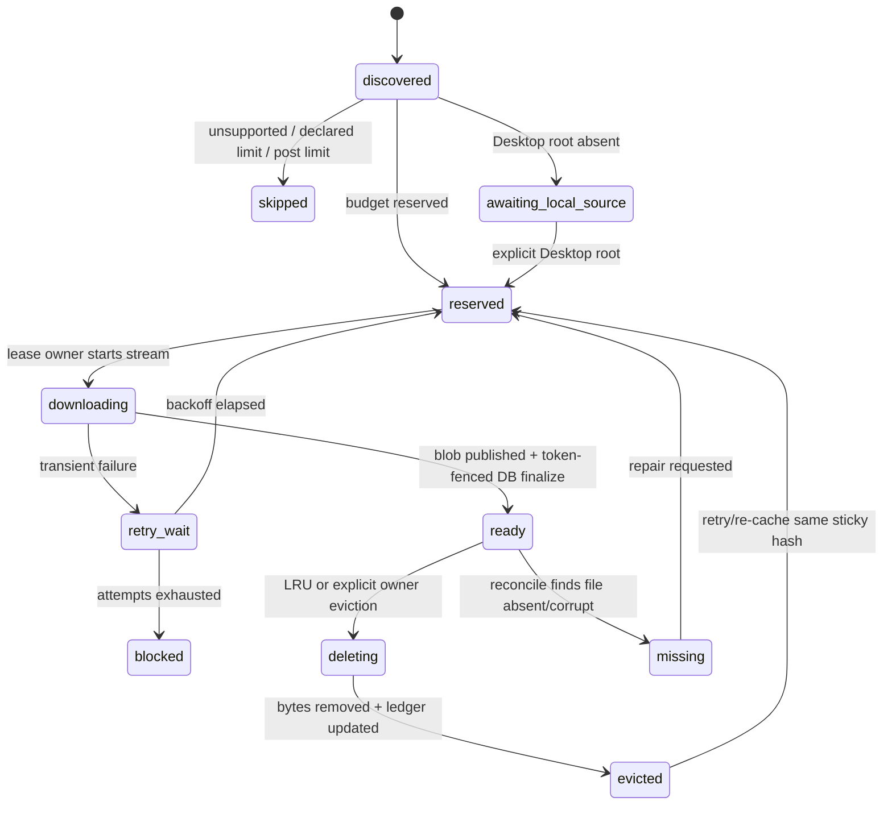
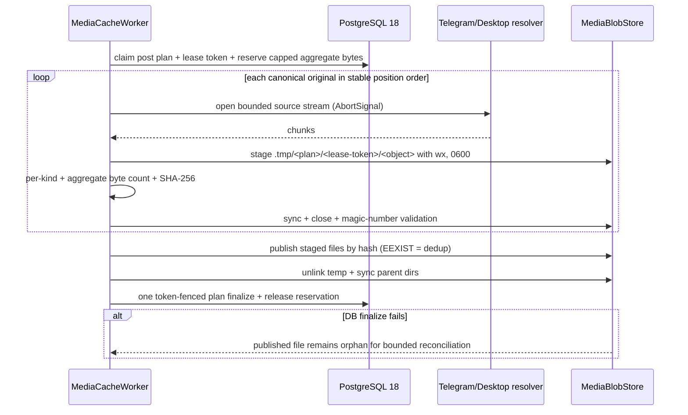

# G2.3 本地媒体缓存设计文档

> 作者：Codex ｜ 日期：2026-07-24 ｜ 状态：Proposed ｜ Issue：[#22](https://github.com/cosZone/koharu-suite/issues/22)

## 1. 背景与问题（Context）

G2.1/G2.2 已经把 Telegram Bot 与 Telegram Desktop 统一为 source-neutral message，并保留了每次
source observation 的媒体 locator/evidence。当前公开 API 仍只返回媒体类型、尺寸、文件名等 metadata，
不提供可读取的本地媒体 URL（`apps/server/src/messages/repository.ts:156-165`、
`apps/server/src/messages/types.ts:90-115`）。

现有两层媒体数据不能混用：

- `message_media` 是 revision-scoped canonical projection；同一 revision 只保留一组公开 metadata
  （`apps/server/src/db/schema.ts:416-458`）。
- `message_source_media_observations` 是 observation-scoped immutable evidence，严格区分 Bot
  `file_id/file_unique_id` 与 Desktop 相对路径，并保留同一内容的多个来源
  （`apps/server/src/db/schema.ts:860-935`）。

因此 G2.3 必须从 source evidence 解析/下载，把“可丢弃的本地副本”放到独立模块，而不能把本地路径、
下载状态或 blob hash 写回 canonical message fingerprint。当前 fingerprint 也刻意只包含内容 metadata，
没有 locator/path（`apps/server/src/messages/fingerprint.ts:20-42`）。

当前 worker 已有单 Bot、多频道、durable task、频道内有序和跨频道并发边界
（`apps/server/src/telegram/worker.ts:56-169`），但 `TelegramApi` 尚无 `getFile` 或流式下载接口
（`apps/server/src/telegram/api.ts:4-17`）。Compose 也只有 PostgreSQL volume，server/worker
没有共享媒体目录（`compose.yaml:13-117`）。

Telegram cloud Bot API 当前只允许 `getFile` 下载最多 20 MB，返回的 `file_path` URL 至少有效一小时；
URL 含 Bot token，绝不能持久化或输出。即使使用 unlimited local Bot API，本方案仍执行自己的
10/20/50 MiB 产品上限。

## 2. 目标与非目标（Goals / Non-Goals）

### Goals

1. 缓存 `photo`、`animation`、`video` 的原始文件：
   - `photo` 最多 `10 * 1024 * 1024` bytes；
   - `animation`、`video` 最多 `20 * 1024 * 1024` bytes；
   - 一条 canonical message 的所有 eligible original 合计最多 `50 * 1024 * 1024` bytes。
2. worker 自动处理 Bot evidence；CLI 可显式提供一次性 Desktop export root 处理 Desktop evidence。
3. 下载过程中流式计算 SHA-256；相同 bytes 跨 observation、message、channel 复用一个 blob。
4. 原始文件、临时文件和 thumbnail 合计不超过 `5 * 1024 * 1024 * 1024` bytes 的应用账本。
5. 对受支持的 raster image 生成静态 WebP thumbnail；不可信输入受 byte、pixel、frame、time 和
   concurrency 限制。
6. 下载、发布、DB finalize、eviction 与 crash recovery 可重跑、token-fenced、可审计。
7. 公开 API 只暴露 opaque suite media object ID；本地文件不存在时稳定降级到 message
   `sourceUrl`，不暴露 Bot token、Telegram `file_path`、`file_id`、Desktop absolute path。
8. Owner Desk 和 `kodama` 提供 usage/status/retry/evict/reconcile；未配置 cache 时现有
   ingestion、API、build 和 Compose 外部署保持原行为。

### Non-Goals

- 不缓存 `audio`、`voice`、一般 `document`；它们继续只展示 metadata 并跳转原帖。
- 不用 ffmpeg，不为视频抽帧；视频 thumbnail 留待未来有独立 video pipeline 时再做。
- 不保留完整动画 thumbnail；`animation` 只尝试读取第一帧作为静态 thumbnail。
- 不支持 S3-compatible storage、local-to-S3 migration、跨 storage LRU 或 protected mark；属于 G2.4。
- 不运行 MTProto/TDLib、Telegram user session、history fetch、讨论区或私有频道。
- 不让 blob 可用性成为 canonical message/revision/source evidence 的前置条件。
- 不把 Desktop export absolute root、Bot token、signed URL 或临时文件路径写入数据库、日志和 API。

## 3. 约束与假设（Constraints & Assumptions）

### 已锁定产品约束

| 项目 | 值 |
|---|---:|
| 图片 original | 10 MiB |
| 动画/视频 original | 20 MiB |
| 单帖 eligible originals | 50 MiB |
| 全局 local cache | 5 GiB |
| SHA-256 | blob identity |
| 超限行为 | 不保存，链接原 Telegram message |
| 操作面 | 初版 CLI + 简洁 Owner Desk |

### 运行约束

- Node.js `>=22.20.0`、PostgreSQL 18、Drizzle generated migration、Linux Compose 是 production
  强保证路径。
- 仍只运行一个 worker service；同一个 Bot token 服务全部 allowlisted public channels。
- cache root 必须是 worker/server 共享的单一 filesystem。worker 读写，server 只读。
- `MEDIA_CACHE_ENABLED=false` 时模块为 disabled/no-op；Compose 默认挂载 named volume，但保持
  disabled，必须由 operator 显式 opt in。
- `MEDIA_CACHE_MAX_BYTES` 可为测试/小磁盘调低，但不得高于 5 GiB；默认 5 GiB。
- DB 与 filesystem 无跨资源事务。设计必须允许“文件已发布但 DB 未提交”的 orphan，禁止“DB ready
  但文件尚未发布”。
- Desktop evidence 只保存安全相对路径。实际读取还必须对用户本次提供的 export root 做
  `realpath` containment，并拒绝 symlink escape。

### 默认假设

- `photo` 的 Bot locator 可直接缓存；`animation/video` 若 Telegram cloud Bot API 自身拒绝，则记录
  `upstream_size_limit`，不自动切换 user account。
- `file_unique_id` 仅用于 source identity/coalescing；最终去重只信实际 bytes 的 SHA-256。
- public media object ID 第一次绑定 blob hash 后，该 hash 永久 sticky；恢复得到不同 bytes 时 fail
  closed，因而可安全使用 immutable response cache。
- 初版 cache mutation 全部 owner-only 或 local operator；service token 只有 `admin:read` 可见的
  sanitized status。现有 `content:write` 不隐式获得 disk deletion 权限。

## 4. 方案设计（Detailed Design）

### 4.1 模块边界

新增 `apps/server/src/media-cache/` 深模块：

| 组件 | 职责 | 不负责 |
|---|---|---|
| `MediaEvidenceReader` | bounded discovery；把 current canonical media 映射到 observation evidence | 下载、路径读取 |
| `MediaSourceResolver` | 把 Bot file ID 或显式 Desktop root 解析为 bounded byte stream | 持久化临时 URL/root |
| `MediaCacheRepository` | durable state、lease/token、budget、LRU、audit | filesystem byte I/O |
| `MediaBlobStore` | temp、SHA-256、sync、atomic publish、open、evict、reconcile | 业务 eligibility |
| `MediaThumbnailer` | safe raster → WebP recipe | 视频抽帧、动画输出 |
| `MediaCacheWorker` | claim → resolve → publish → finalize；restart/retry | canonical message write |
| `MediaCacheService` | CLI/Admin/public read 的窄接口 | 直接暴露 DB row/path |

`PostgresMessageRepository` 继续只写 canonical/source evidence。cache discovery 依赖 evidence 的
append-only `(created_at, id)` cursor，不在 ingestion transaction 内做网络或文件 I/O。cache object
以 canonical `message_media.id` 为公开身份，source evidence 只提供 locator；不能把历史/stale/conflict
observation 直接发布。

worker runtime 是 Bot 自动缓存的装配点（现有装配见 `apps/server/src/runtime.ts:328-365`）；
server runtime 只装配 public read 和 Admin surface。

### 4.2 Eligibility

discovery 按 `message_source_media_observations(created_at, id)` keyset 分批读取，但只接受：

1. observation resolution 为 `created|matched`，且 `revision_id` 非空；
2. revision 是 non-tombstoned message 的 current revision；
3. evidence position 能唯一映射到同 revision/position 的 canonical `message_media`；
4. source availability=`available`，media kind 为 `photo|animation|video`；
5. 对同一 current revision 建立一个 post plan，按不同 `message_media.id` 冻结 eligible original
   集合，不按重复 observation 汇总：
   - 单个 item 已知 declared size 超过 kind limit → 仅该 item `skipped_kind_limit`，从 plan
     eligible originals 排除，不影响同帖其他媒体；
   - 已知部分的 declared size 已超过 50 MiB → 整帖 plan `skipped_post_limit`；
   - 其余 plan（包括全部 size 已知）仍先顺序下载到 staging，不 publish；单个 stream 实际超过
     kind limit 时删除该 item temp、标记 `skipped_kind_limit`，继续剩余 items；actual aggregate
     超过 50 MiB 时删除全部 staged files，并把整帖 original 标为 `skipped_post_limit`；
   - 只有 plan 内所有仍可用 originals 都通过 per-kind 与 actual aggregate 检查后，才批量 publish
     并在一个 token-fenced DB transaction 内变成 ready。因此结果不依赖 object claim 顺序；
6. source 为 Desktop 时不由常驻 worker 自动读取；对象保持 `awaiting_local_source`，只在 local
   CLI 显式绑定 exact `import_run_id`、原始 `result.json` 和 export root 后 claim。CLI 重算 JSON
   SHA-256，必须与 import run 相同，并且只允许读取该 run 精确关联的 observations。

一个 cache object 可关联多条 source evidence，但只能关联一个 canonical media。Bot evidence 优先；
fallback source 只有实际 bytes 与 object sticky hash 相同时才可恢复。公开读取必须重新验证 canonical
media 仍属于 current、未 tombstone message，否则普通 `404`。

### 4.3 状态机



original object 的首次 `reserved/downloading/ready/skipped` 由 post plan 作为一个 unit 推进；不能在
plan actual aggregate 尚未验证时让单个 original 公开 ready。首次 plan ready 表示整组已完成预算与
integrity 验证；此后 LRU/missing/re-cache 可让单个 shared-blob object 独立 evicted/ready，不回滚
首次 plan 验证。thumbnail 在 original plan 首次 ready 后独立运行。

终态 `skipped` 使用枚举 reason code，不保存上游错误正文。`blocked/missing` 的错误只保留
sanitized class/code；最多 10 次 retry，指数 backoff `1s…5m`，owner 可带 reason 重试。

### 4.4 数据模型

#### `media_cache_runtime`（singleton）

- `singleton_key = 'local'`
- `discovery_cursor_created_at`, `discovery_cursor_id`
- `ready_bytes bigint >= 0`
- `reserved_bytes bigint >= 0`
- `max_bytes bigint`，运行时不得超过 5 GiB
- `last_reconciled_at`, `updated_at`

所有 reservation/finalize/eviction counter 更新使用一个 media-cache advisory xact lock。`kodama
doctor` 重新求和校验 counter 与 blob rows，不静默修复。

#### `media_cache_post_plans`

- `id uuid` primary key
- `message_id uuid`, `revision_id uuid`
- composite FK `(revision_id, message_id)` → `message_revisions(id, message_id)`
- `state`：`discovered|reserved|staging|ready|skipped|retry_wait|blocked`
- `ready_original_bytes`, `reserved_original_bytes`，合计不得超过 50 MiB
- plan lease/token/retry fields
- unique `revision_id`

为支持数据库级 lineage，migration 同时给 `message_revisions(id, message_id)` 增加 composite unique，
给 `message_media(id, revision_id)` 增加 composite unique。post budget 存在 plan row，不让 object
携带可与 canonical media 矛盾的冗余 `message_id`。

#### `media_cache_objects`

- `id uuid`：公开 opaque ID
- `post_plan_id uuid`, `revision_id uuid`
- composite FK `(post_plan_id, revision_id)` → `media_cache_post_plans(id, revision_id)`
- `canonical_media_id uuid`
- composite FK `(canonical_media_id, revision_id)` → `message_media(id, revision_id)`
- `variant`：`original|thumbnail`
- `recipe_version integer`；original 固定 `1`
- `state`：上图状态
- `blob_sha256 char(64)` nullable，FK 到 blobs，`ON DELETE RESTRICT`
- `declared_bytes`, `reserved_bytes`, `actual_bytes`
- `reason_code`, `attempt_count`, `available_at`
- `lease_owner`, `lease_token`, `lease_expires_at`
- `last_accessed_at`, `created_at`, `updated_at`
- `blob_sha256` 第一次非空后不可改；不同 bytes 进入 `integrity_conflict`，不能复用 object ID
- unique `(canonical_media_id, variant, recipe_version)`

多个 object 可指向同一 blob。object eviction 只表示本地副本缺失，不删除 evidence。

#### `media_cache_object_sources`

- `(object_id, source_media_observation_id)` composite primary key
- `source_priority`：Bot available 优先，其次 exact Desktop import-run evidence
- evidence FK `RESTRICT`

source mapping 允许同一个 canonical media 使用多条 locator evidence，但 public ID 只有一个。历史
revision、stale/conflict observation 不进入 mapping。resolver 固定按
`(source_priority, observation.created_at, observation.id)` 选择：

- transient error：停止 fallback，按同一 source retry，避免每次结果漂移；
- permanent locator unavailable/unsupported content 且 object 尚无 sticky hash：尝试下一 source；
- 已有 sticky hash 时，任一 source 返回不同 bytes 都进入 `integrity_conflict`，不尝试用不同内容
  覆盖 immutable object。

#### `media_cache_blobs`

- `sha256 char(64)` primary key
- `byte_length bigint`
- `detected_mime varchar`
- `relative_key text`：只能等于 `blobs/ab/cd/<64-hex>` 的 canonical derived key
- `state`：`ready|deleting|evicted|missing`
- `last_accessed_at`, `created_at`, `updated_at`

blob row 在 eviction 后继续保留 sticky hash/size/MIME/relative key，不删除。相同 hash 的 size/MIME
不一致时 fail closed 并产生 reconcile finding。重新发布相同 hash 后，同一事务把引用该 hash 的
eligible evicted objects 恢复为 ready；不同 hash 不得恢复旧 object。

#### `media_cache_actions`

- `id`, optional `object_id`, optional `blob_sha256`
- `action_kind`：`retry|evict|reconcile|recover_orphan|restore_missing`
- `initiator_kind`：`local_operator|owner_session|worker`
- `initiator_id`, `reason`, `before_state`, `after_state`, `created_at`

worker 自动状态 transition 仍有 structured audit；owner/local mutation 强制 1–500 字符 reason。

### 4.5 下载与原子发布



实现要求：

- 使用 Node 22 built-in `fetch`/Web Streams、`stream/promises.pipeline`、`crypto.createHash`；
  不新增 `undici` direct dependency，不把完整 original 放进 Buffer。
- `Content-Length`/declared size 只做提前拒绝；Transform 对实际 bytes 做最终硬限制并 abort 上游。
- temp 与 final 必须同 filesystem。temp 用 `open('wx', 0o600)`。
- staging path 包含 canonical UUID lease token，不能由 source filename 构造。takeover 只在 DB
  token-fenced 证明旧 lease 已过期后，删除并 sync 旧 token staging tree；清理成功才释放旧
  reservation/创建新 reservation。清理失败进入 `temp_cleanup_failed`，不得仅换新 temp 路径继续
  占盘。启动的一小时 orphan grace 只处理无法关联任何 DB lease 的残留，不阻塞同 plan 立即恢复。
- 使用 `file-type` 从 temp file 的 magic number 检测 MIME，不信任 filename/declared MIME：
  - photo：JPEG/PNG/WebP/AVIF；
  - animation：GIF/WebP/MP4；
  - video：MP4/WebM；
  - mismatch/unknown → `unsupported_content`，不 publish。
- validation 通过后 `link(temp, final)` 做 atomic no-clobber publish；并发 loser 收到 `EEXIST`
  后验证/复用已有 content-addressed file。普通 `rename` 不作为 dedup no-replace primitive。
- Linux 上 publish 后 fsync parent directory。其他平台若 directory fsync 不支持，记录 capability
  downgrade；仍必须通过平台集成测试。
- DB 只在 publish 后写 `ready`。startup reconcile 清理超过一小时且无 active lease 的 temp/orphan。
- 下载 URL 只存在 resolver 局部变量；日志只记录 object UUID、source kind、reason code。

### 4.6 Budget 与 LRU

reservation 在 advisory-lock transaction 内执行：

```text
ready_bytes + reserved_bytes + requested_reservation <= configured_max_bytes
```

- post plan 一次 reservation：
  `min(sum(each original kind hard limit), 50 MiB)`。例如三个 declared/actual 16 MiB video
  reservation 为 50 MiB，顺序 staging 的 aggregate limiter 允许实际 48 MiB 成功；超过 50 MiB
  则整帖不 publish。
- plan reservation 同时计入 global `reserved_bytes` 与 plan `reserved_original_bytes`；staging
  Transform 的 aggregate hard limit 就是 50 MiB，per-item Transform 仍执行 10/20 MiB。
- finalize 在同一 transaction 设置 plan logical `ready_original_bytes` 为各 ready original object
  actual bytes 之和；global physical `ready_bytes` 只增加本次新发布的 unique blob bytes。
  plan 内重复 hash、跨 plan 已有 blob 或 `link(...)=EEXIST` 的 physical 增量为零。这样既不因
  declared metadata 低报突破上限，也不因 dedup 虚高全局账本。
- thumbnail 独立 reservation，最多 1 MiB；不与 original 重复预留。
- 为腾出空间，按 blob `last_accessed_at ASC, sha256 ASC` claim `ready → deleting`；
- eviction 两阶段执行：第一事务只 claim `deleting`，bytes 继续计入 `ready_bytes`；filesystem
  unlink + parent directory sync 成功后，第二个 token-fenced 事务才把 blob/关联 objects 标为
  `evicted` 并扣一次 bytes。unlink 失败则恢复 ready 或留给 reconcile，绝不提前释放账本。
- eviction/missing 对每个关联 original object 按
  `(post_plan_id, canonical_media_id, object_id)` 稳定顺序锁定 plan row 并扣除 logical
  `ready_original_bytes`；global physical bytes 只扣一次。
- shared blob 重新出现时同样按稳定顺序锁定全部相关 plan：满足 current-plan 与 50 MiB 约束的
  evicted objects 可恢复 ready 并增加各自 logical bytes；不满足者保持 evicted。不能因为 physical
  blob 已存在而跳过 post budget。
- public reader 看见 object/blob 不再 ready 时直接 404，调用方使用 message `sourceUrl`；
- reader access coalesce 最终更新 shared blob 的 `last_accessed_at=max(observed access)`，LRU 不按
  单个 object 的旧时间淘汰 shared bytes。
- reader 已经 open file handle 后，Linux unlink 不影响当前 response；claim 与 open 竞态导致
  `ENOENT` 时同样安全 fallback；
- OS `statfs` 可作为磁盘剩余空间第二道 fail-closed guard，但 5 GiB DB ledger 是应用权威。

G2.3 没有 protected mark。owner 显式 eviction 只改变 cache；任何 ready blob 都可按 LRU evict。

### 4.7 Thumbnail recipe v1

新增 `sharp` 与 `file-type` 两个直接依赖：前者只做 thumbnail，后者只做 magic-number type
detection；不用 Jimp、node-canvas、ImageMagick 或 WASM codec 组合。

recipe v1：

- 输入：`photo`，或 Sharp 能识别的 `animation` raster first page；
- 拒绝 SVG/PDF；视频不进入 Sharp；
- constructor：
  - `limitInputPixels: 33_554_432`（32 MP）；
  - `limitInputChannels: 4`；
  - `failOn: 'warning'`；
  - `sequentialRead: true`；
  - `pages: 1`，绝不设置 `animated: true`；
- `.autoOrient()`；
- `.resize({ width: 1280, height: 1280, fit: 'inside', withoutEnlargement: true })`；
- `.webp({ quality: 82, effort: 4 })`；
- `.timeout({ seconds: 5 })`；
- Sharp 输出必须通过 byte-limiting stream 写 temp，不使用 `toBuffer()`；超过 1 MiB 立即 abort。
  unsupported/corrupt/timeout 时只记
  `thumbnail_unavailable`，不影响 ready original；
- 默认删除 EXIF/GPS 等 metadata；
- thumbnail job concurrency `1`；process 级 `sharp.concurrency(1)`；
  `sharp.cache({ memory: 16, files: 0, items: 32 })`。CI 用恶意 32 MP 输入验证峰值内存预算。

`recipe_version` 是 production byte-output compatibility boundary，不只是参数版本。任何可能改变输出 bytes 的
Sharp/libvips major/minor upgrade、codec build、WebP encoder 或上述参数变化都必须 bump
`recipe_version`，生成新的 object UUID。固定 fixture 只在 production-supported Linux CI/runtime
image toolchain 比较 expected hash；同 recipe 的 Linux hash 漂移直接让 build/doctor fail。macOS
等非 production 平台只验证 format/dimensions/metadata safety，不要求 byte-identical。若未来允许
多个 production codec/platform 生成，则把 compatibility ID 纳入 recipe identity。

### 4.8 Public/Admin/CLI

#### Public

- `PublicMedia` 增加 stable suite media ID、`originalUrl|null`、`thumbnailUrl|null` 和 cache status；
  不增加 locator/path/hash。
- `GET /api/v1/media/:objectId`：
  - 只接受 canonical UUID；
  - object+blob 必须 `ready`；
  - object 的 canonical media 必须仍是 current、non-tombstoned public message；
  - server 根据 DB-derived canonical relative key 在 cache root 内 `open`，不用用户路径；
  - `Content-Type` 使用 detected allowlist MIME，`Content-Length` 使用 verified bytes；
  - `ETag` 可由 hash 生成，但响应/API body 不返回 hash；
  - `Cache-Control: public, max-age=31536000, immutable`；
  - `X-Content-Type-Options: nosniff`；
  - absent/evicted/missing 均普通 `404`，绝不 redirect 到含 Bot token 的 file URL。
  - `HEAD` 与 `GET` 共享 metadata；GET 从已打开 fd 流式输出，禁止 `readFile()`/whole-file Buffer；
  - original 支持一个 RFC byte range：closed/open-ended/suffix range 返回 `206`、`Content-Range` 和
    `Accept-Ranges: bytes`；invalid/unsatisfiable/multiple range 返回
    `416 Content-Range: bytes */<size>`；`If-Range` 不匹配时返回完整 `200`；
  - thumbnail 只返回完整 `200`，不声明 range。

公开 message 已有 `sourceUrl`（`apps/server/src/messages/repository.ts:168-188`）。客户端在 media URL
null/404 时显示“在 Telegram 查看原消息”。

#### Admin / Owner Desk

- `admin:read`：usage、state counts、sanitized recent failures、object status；
- owner session：带 reason retry、evict、reconcile；
- service token：G2.3 不授予 mutation；避免把既有宽泛 `content:write` 解释为 disk deletion；
- 所有 Admin response 继续 `Cache-Control: private, no-store`
  （现有 boundary 见 `apps/server/src/app.ts:262-277`）。

Owner Desk 初版增加一个简单 Cache panel：enabled/disabled、used/reserved/max、状态计数、最近失败、
分页 object 列表、retry/evict/reconcile confirmation。

#### CLI

- `kodama media status [--json]`
- `kodama media scan [--channel ...] [--json]`
- `kodama media cache --import-run <uuid> --input <result.json> --desktop-root <path> --apply --reason <text>`
- `kodama media prune [--target-bytes <n>]` 默认 dry-run；mutation 要 `--apply --reason`
- `kodama media reconcile` 默认 dry-run；修复账本/temp/orphan 要 `--apply --reason`

CLI 输出绝对路径、Desktop root、file ID、token、临时 URL 时一律 redacted。

### 4.9 Compose 与 filesystem contract

- 新增 named volume `media-cache-data`，但 `MEDIA_CACHE_ENABLED` 默认 `false`。
- worker opt-in 后使用 `MEDIA_CACHE_ROOT=/var/lib/koharu/media-cache`，read-write mount。
- server 使用相同 root，read-only mount；disabled 时不注册 public media handler。
- image build 预建 root 并归属 runtime `node` 用户；Compose smoke 验证 node UID 可写。
- backup manifest 只要求 DB + blob tree 一致性说明；cache 本身可删除/重建，不进入 canonical
  archive 恢复成功的必要集合。
- operator 删除整个 volume 后先运行 `kodama media reconcile --apply --reason ...`，把 DB ready
  object 标为 missing/evicted，再由 worker bounded recache。

## 5. 备选方案与权衡（Alternatives Considered）

| 方案 | 优点 | 代价 / 风险 | 是否采用 |
|---|---|---|---|
| A. DB ledger + filesystem content-addressed blobs + Sharp + file-type | streaming；跨来源去重；magic-number allowlist；5 GiB 可审计；未来可接 storage adapter | DB/FS 无原子事务，需要 orphan/missing reconcile；Sharp 是 native dependency | ✅ |
| B. 把 binary 存 PostgreSQL `bytea` | 单事务、backup 简单 | 放大 WAL/backup/DB I/O；5 GiB LRU 与 HTTP streaming 压力进入主数据库 | ❌ |
| C. 用 `file_unique_id` 直接当文件名/去重键 | 下载前可 coalesce，模型简单 | 它不是 content hash；Desktop 无等价键；不能证明 bytes 相同 | ❌，只作 source identity |
| D. 每条 message 独立目录保存文件 | 容易人工浏览 | 重复 bytes、rename/message 生命周期耦合、跨来源难去重 | ❌ |
| E. Jimp/纯 JS thumbnail | 无 native binary，安装简单 | untrusted 大图内存/CPU 差，吞吐与格式能力不足 | ❌ |
| F. ImageMagick/ffmpeg 子进程 | 格式与视频能力强 | 系统依赖、版本漂移、进程 sandbox/攻击面、镜像更大 | ❌，视频 thumbnail 后议 |
| G. 现在直接抽象 Local/S3 `StorageDriver` | 提前覆盖 G2.4 | 会把 migration/LRU/protection/S3 consistency 提前塞入本 Goal | ❌；只保留窄 `MediaBlobStore` seam |
| H. 信任 Telegram filename/MIME | 无额外 sniff dependency | metadata 可错配，不能安全决定 public `Content-Type` | ❌ |

推荐会在以下前提改变：

- 若 binary 必须和 DB 做强原子备份，重新评估 object storage/transactional manifest；
- 若正式要求视频 thumbnail，引入独立 sandboxed ffmpeg worker，而不是扩大 Sharp 职责；
- 若多 worker 横向扩展成为正式合同，cache root 必须换成 shared storage 或明确 per-node cache。

## 6. 横切关注点（Cross-cutting Concerns）

### 安全 / 隐私

- path traversal：public 只用 UUID；relative key 由 hash 推导并做 schema check。
- Desktop：`realpath(root)` + `realpath(candidate)` containment；拒绝 symlink escape、absolute/URI/backslash
  和 `..`。
- token：Telegram download URL 禁止 DB/log/audit/API；错误只保留 class/code。
- content：不信任 extension/MIME/Content-Length；detected MIME allowlist + `nosniff`。
- image bomb：32 MP、4 channel、single page、5s、1 MiB streaming output、job/libvips concurrency 1。
- files：temp `0600`；runtime volume 不被静态文件中间件直接映射。

### 性能 / 容量

- original streaming，内存不随文件大小线性增长。
- 下载 concurrency 默认 2（不得超过 4）；thumbnail concurrency 和 `sharp.concurrency()` 均为 1。
- discovery、Admin list、reconcile、orphan scan、LRU 都有 keyset/batch 上限。
- public access time 不逐请求同步写 DB；进程内 coalesce 后最多每 object 5 分钟写一次
  `last_accessed_at`，允许 LRU 近似。

### 可观测性

metrics/log fields 只含 object UUID、source kind、media kind、state/reason、bytes、duration：

- queue depth / active leases / retry / blocked；
- ready/reserved/max bytes；
- download bytes/duration/result；
- dedup hits；
- thumbnail result；
- eviction bytes/count；
- temp/orphan/missing count；
- reconcile drift。

告警建议：`reserved > max`、counter mismatch、ready missing file、temp 超过一小时、连续 disk-full、
blocked 增长、download/thumbnail timeout rate。

### 错误与降级

- cache disabled、download fail、thumbnail fail、eviction、missing file 都不影响 message API success。
- original ready + thumbnail fail：公开 original 仍可用。
- original absent：公开 media metadata + Telegram source link。
- DB 不可用：不读 filesystem 猜测 object；public media endpoint fail closed。

## 7. 影响面与风险（Impact & Risks）

| 影响面 | 风险 | 缓解 |
|---|---|---|
| `db/schema.ts` + migration | 状态/counter constraint 错误 | generated migration、PG18 backfill/constraint tests |
| worker runtime | media loop 故障拖垮 ingestion | 独立 lifetime/concurrency；failure isolation；graceful stop |
| Telegram API | token URL 泄漏、20 MB upstream limit | resolver 局部 URL、sanitized error、业务 hard cap |
| filesystem | partial/orphan/disk-full/permission | temp+sync+link、reservation、reconcile、Compose smoke |
| Sharp native package | lockfile/platform/musl | Linux glibc CI/image；pnpm optional dependency audit；不切 Alpine |
| public API | Astro consumer schema 变化 | additive nullable media fields；旧 fields/IDs 保持 |
| LRU/public stream | delete/open race | deleting state + open failure fallback；Linux handle semantics |
| Desktop root | symlink escape、root 泄漏 | explicit local-only root、realpath containment、redaction |

## 8. 上线与回滚（Rollout & Migration）

1. 合并 additive migration，所有 cache 表为空；不自动网络回填。
2. `kodama doctor` 验证 schema、root ownership、hard-link、file sync、free space、Sharp capability。
3. cache disabled 环境先部署 server/worker，验证与 G2.2 行为相同。
4. 保持 disabled，先运行 status/scan dry-run 并检查 filesystem capability。
5. operator 显式设置 `MEDIA_CACHE_ENABLED=true` 后，worker 才从最早 evidence bounded discovery
   并自动下载 Bot media；Desktop 仍只由显式 CLI。
6. public API media fields/endpoint 最后启用，先验证 fallback。

回滚：

- 回滚应用前停止 server/worker；新表/volume 保留，不做 destructive down migration。
- G2.2 binary 不读取 cache fields，canonical API 仍可工作。
- 若新 public fields 已被 consumer 依赖，先回滚 consumer 或保持 G2.3 server。
- 删除 cache volume 是可恢复操作，但会丢本地副本；DB reconcile 后再 recache。
- migration 不删除 source evidence；cache table FK 不级联删除 evidence。

## 9. 测试策略（Testing）

### Unit

- eligibility：kind/10/20/50 MiB/unknown size；
- post plan：三个 16 MiB video 成功为 48 MiB；任何 item 令 actual aggregate >50 MiB 时整帖不 publish；
- byte counting、SHA-256、Content-Length mismatch、abort；
- retry/backoff/sanitized error；
- canonical relative key、realpath/symlink containment；
- state transition/token fencing；
- report/redaction/public header；
- thumbnail recipe/unsupported/timeout/output cap、固定 fixture hash 与 recipe bump。

### PostgreSQL 18 integration

- discovery cursor/restart/idempotency；
- claim/lease/takeover；
- post-plan reservation/finalize/counter constraints；
- same blob across channel/source/object dedup；
- dedup 时 plan logical bytes 逐 object 增加、global physical bytes 只按 unique blob 增加；
- concurrent finalize、LRU claim、all linked object eviction；
- shared blob eviction/missing/restore 对每个 post-plan logical budget 的增减；
- audit/CAS/owner/service-token authority；
- migration/doctor/rollback compatibility。

### Filesystem integration

- partial stream、oversize、checksum、disk-full、permission；
- same-hash concurrent `link` winner/loser；
- publish succeeds + DB rollback orphan；
- DB ready + file missing；
- crash residue temp cleanup；
- expired lease takeover 立即清除旧 token staging/reservation，不等待 orphan grace；
- Desktop symlink escape；
- open-versus-evict race；
- 5 GiB 用较小 injected limit 做 deterministic test。

### HTTP / GUI / CLI

- opaque ID、404 fallback、MIME/length/ETag/cache/nosniff、range policy；
- Admin private/no-store、pagination/redaction；
- Owner Desk keyboard/a11y、retry/evict confirmation；
- CLI dry-run/apply/reason/JSON/exit code。

### Release gates

`pnpm lint`、`pnpm typecheck`、unit、PG18 integration、filesystem integration、build、Storybook、
`pnpm db:generate`、Compose config/smoke、independent P0/P1/P2 review、CI。

## 10. 待决问题（Open Questions）

以下均给出推荐默认值，必须由 owner 确认后才视为设计门槛通过：

1. **支持种类**：推荐只缓存 `photo|animation|video` original；`audio|voice|document` 只 fallback。
2. **thumbnail**：推荐 photo + 可被 Sharp 识别的 animation 第一帧；不做视频抽帧。
3. **Desktop**：推荐仅 local operator CLI 临时提供 root；Owner Desk 不接受 server absolute path。
4. **权限**：推荐 owner/local operator 才能 retry/evict/reconcile apply；service token 只读。
5. **access time**：推荐五分钟 coalesced approximate LRU，不为每次 GET 写 PostgreSQL。

## 11. 参考（References）

- Roadmap [#1](https://github.com/cosZone/koharu-suite/issues/1)
- G2.3 Issue [#22](https://github.com/cosZone/koharu-suite/issues/22)
- G2.2 PR [#20](https://github.com/cosZone/koharu-suite/pull/20)
- [Telegram Bot API `getFile`](https://core.telegram.org/bots/api#getfile)
- [Telegram Local Bot API](https://core.telegram.org/bots/features#local-bot-api)
- [Node.js 22 stream pipeline](https://nodejs.org/docs/latest-v22.x/api/stream.html#streampromisespipeline-streams-options)
- [Node.js 22 crypto hash](https://nodejs.org/docs/latest-v22.x/api/crypto.html#cryptocreatehashalgorithm-options)
- [Node.js file flags, link, sync and statfs](https://nodejs.org/docs/latest-v22.x/api/fs.html)
- [Sharp constructor safety options](https://sharp.pixelplumbing.com/api-constructor/)
- [Sharp resize/output/resource controls](https://sharp.pixelplumbing.com/api-resize/)
- [file-type magic-number detection](https://github.com/sindresorhus/file-type)
