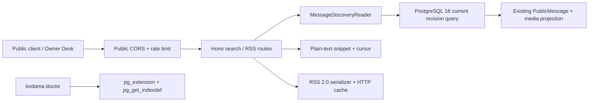

# G2.5 — 搜索与 RSS 设计文档

> 作者：Codex ｜ 日期：2026-07-24 ｜ 状态：Approved ｜ Issue：[#26](https://github.com/cosZone/koharu-suite/issues/26)

## 1. 背景与问题（Context）

G1.5 已提供频道内消息列表与详情，但读取者只能按 suite channel UUID 顺序翻页，不能跨频道发现内容；
Roadmap 因此把 `pg_trgm`、短查询降级、频道/时间过滤和全局/频道 RSS 定为 G2.5
（[#1](https://github.com/cosZone/koharu-suite/issues/1)）。

现有模型已经具备一个可复用、无需复制数据的公开投影：

- `messages.current_revision_number` 指向唯一 current revision，`tombstoned_at` 控制公开可见性
  （`apps/server/src/db/schema.ts:358-415`）；
- `PostgresMessageRepository.selectMessages()` 只连接 current revision、排除 tombstone，并统一附加
  local/S3-aware 的公开媒体投影（`apps/server/src/messages/repository.ts:626-682`）；
- `PublicMessage` 不包含 raw update、Telegram numeric IDs、内部 file locator 或 storage backend
  （`apps/server/src/messages/types.ts:78-124`）；
- 公开路由统一受 exact-origin CORS 和单进程 fixed-window rate limit 约束
  （`apps/server/src/app.ts:341-476`）；
- `BETTER_AUTH_URL` 已被验证为 HTTPS（localhost 例外）、无 credentials/path/query/hash 的 canonical
  origin（`apps/server/src/config.ts:127-193`）。

G2.5 必须复用这些事实源。若另建异步 search document/feed cache，编辑、tombstone、媒体迁移和恢复
会出现第二套可见性时钟，也会为 G2.6 Astro adapter 留下错误合同。

## 2. 目标与非目标（Goals / Non-Goals）

### Goals

1. 在 PostgreSQL 18 上用 `pg_trgm` 搜索所有可见 current revision 正文。
2. 支持可选频道与 UTC 时间范围、相关性/最新排序、query-bound keyset cursor。
3. 允许 1–2 Unicode code point 查询，但必须限制到单频道、显式不超过 31 天窗口、每页最多 20。
4. 提供公开全局与频道 RSS 2.0，固定最近 50 条，不分页。
5. RSS 的 absolute URL、XML、ETag、Last-Modified、GET/HEAD/304 行为可预测且安全。
6. Owner Desk 提供真实搜索界面和 feed 入口；`kodama doctor` 验证 search capability。
7. 不改变现有消息、权限、tombstone、local/S3 媒体和静态-only astro-koharu 合同。

### Non-Goals

- 不引入 `pg_bigm`、Elasticsearch/OpenSearch、vector/semantic search、typo correction 或 query analytics。
- 不搜索历史 revision、raw source evidence、媒体文件名、频道标题或 author signature。
- 不返回 `<mark>` 或其他 search-generated HTML；snippet 始终是纯文本。
- 不提供 saved search、private/authenticated feed、feed pagination、WebSub、enclosure 或 podcast extension。
- 不在本 Goal 实现 G2.6 Astro adapter、G2.7 astro-koharu integration、讨论区或文章发布。
- 不新增常驻 search indexing worker、metrics table 或高频 discovery status poll。

## 3. 约束与假设（Constraints & Assumptions）

- PostgreSQL major 固定为 18；Compose、Testcontainers 和 CI 统一使用 18。
- migration role 能执行 `CREATE EXTENSION IF NOT EXISTS pg_trgm`。安装失败时 migration fail closed。
- `BETTER_AUTH_URL` 同时是 Admin/API/RSS 的 canonical public origin；本 Goal 不新增可漂移的第二个
  public-origin 配置。
- 时间过滤的 `from` inclusive、`to` exclusive；二者必须是 canonical ISO 8601 UTC timestamp。
- `q` trim 后以 Unicode code points 计数，范围 1–200。
- Search 默认 `sort=relevance`；1–2 字符模式固定 `newest`，显式 `relevance` 返回 400。
- 普通搜索 `limit` 默认 20、范围 1–50；短搜索范围 1–20。
- PostgreSQL score 只用于页内排序和 cursor，不承诺跨版本的绝对语义。

## 4. 方案设计（Detailed Design）

### 4.1 模块边界



- `messages/search.ts`：search input/result types、query canonicalization、cursor、snippet。
- `messages/repository.ts`：唯一 PostgreSQL discovery reader；复用 current revision 和 media projection。
- `messages/rss.ts`：纯 RSS serializer、XML sanitization、ETag metadata，不访问数据库。
- `app.ts`：validation、error mapping、public policy、GET/HEAD/conditional request。
- `ops/doctor*.ts`：只读验证 extension、opclass、partial predicate 和 canonical origin。
- `App.tsx`：独立 search state，不进入 dashboard initial `Promise.all` 或 10 秒 status poller。

### 4.2 Search HTTP contract

```http
GET /api/v1/search/messages
  ?q=<text>
  &channel=<suite UUID>          # optional for 3+ chars, required for 1–2
  &from=<ISO UTC>                # optional for 3+ chars, required for 1–2
  &to=<ISO UTC>                  # optional for 3+ chars, required for 1–2
  &sort=relevance|newest         # default relevance; short mode newest only
  &limit=20
  &cursor=<opaque>
```

```ts
interface SearchMessageResponse {
  items: Array<{
    message: PublicMessage;
    match: {
      score: number | null;
      snippet: string;
    };
  }>;
  mode: 'trigram' | 'short_substring';
  nextCursor: string | null;
}
```

Validation errors use the existing `{ error: { code, message } }` envelope:

| Condition | Status / code |
|---|---|
| missing/empty/over-200 `q` | `400 invalid_query` |
| invalid channel UUID | `400 invalid_channel` |
| unknown channel | `404 channel_not_found` |
| invalid/non-UTC/from >= to | `400 invalid_time_range` |
| invalid sort/limit | `400 invalid_sort` / `400 invalid_limit` |
| 1–2 chars without bounded scope or with relevance | `400 short_query_requires_bounded_scope` |
| malformed or query-mismatched cursor | `400 invalid_cursor` |

`q` is a literal substring, not SQL wildcard syntax. `%`, `_` and `\` are escaped before `ILIKE ... ESCAPE '\'`.
Only rows satisfying the literal substring predicate are results; trigram similarity influences ordering but cannot
introduce fuzzy non-matches.

### 4.3 Search SQL and indexes

Every query joins:

```sql
messages m
JOIN message_revisions r
  ON r.message_id = m.id
 AND r.revision_number = m.current_revision_number
WHERE m.tombstoned_at IS NULL
  AND r.text IS NOT NULL
```

For 3+ code points:

```sql
r.text ILIKE ('%' || :escaped_query || '%') ESCAPE '\'
word_similarity(:query, r.text)
```

Required DDL:

```sql
CREATE EXTENSION IF NOT EXISTS pg_trgm;
CREATE INDEX message_revisions_text_trgm_idx
  ON message_revisions USING gin (text gin_trgm_ops)
  WHERE text IS NOT NULL;
CREATE INDEX messages_public_published_idx
  ON messages (published_at, id)
  WHERE tombstoned_at IS NULL;
```

The extension migration is ordered before the generated index migration. Rollback may remove project-owned
indexes but does not drop `pg_trgm`, because it can be shared by other database objects.

### 4.4 Ordering, snapshot and cursor

`newest` order:

```text
publishedAt DESC, messageId DESC
```

`relevance` order:

```text
score DESC, publishedAt DESC, messageId DESC
```

Cursor JSON is canonical base64url and versioned. It contains:

```ts
{
  v: 1;
  queryHash: string;       // SHA-256 of q/channel/from/to/effective sort
  snapshotAt: string;      // first page server time
  score?: number;          // relevance only
  publishedAt: string;
  messageId: string;
}
```

Queries require `messages.created_at <= snapshotAt` and `messages.updated_at <= snapshotAt`, while always
re-checking current tombstone/current revision. This prevents newly inserted older messages or newly edited
messages from moving into later pages, while a hide still takes effect immediately. An edit after the snapshot
may disappear from later pages rather than leak an obsolete revision or duplicate a prior hit.
No route uses `OFFSET`.

### 4.5 Snippet

Snippet generation is a pure function over the already-selected current `text`:

- at most 280 Unicode code points;
- center around the first case-insensitive match when found, otherwise use the beginning;
- prefix/suffix ellipsis only when text was clipped;
- preserve content as plain text; React renders it as a text node;
- score is finite and normalized for JSON; newest/short mode returns `null`.

### 4.6 RSS 2.0 contract

```http
GET|HEAD /api/v1/rss.xml
GET|HEAD /api/v1/channels/:suiteChannelId/rss.xml
```

Both feeds contain at most 50 visible current messages with
`publishedAt DESC, messageId DESC`. Unknown channel UUIDs return 404; invalid UUIDs return 400.

Each item contains:

- stable `<guid isPermaLink="false">urn:uuid:<suiteMessageId></guid>`;
- `<pubDate>` derived from `publishedAt`;
- `<link>` and `<comments>` are not conflated: the item link prefers public Telegram `sourceUrl`, otherwise
  `${canonicalOrigin}/api/v1/messages/:id`;
- escaped title summary from plain text, or a media-only fallback;
- `<description>` containing stored safe HTML as XML-escaped text.

Feed self URLs and all suite fallback URLs are constructed from the injected canonical origin, never request
headers. V1 deliberately emits no media enclosure; local/S3 media remains available through the linked public
message projection without changing feed identity.

The serializer removes XML 1.0-invalid control characters and unpaired UTF-16 surrogates, then XML-escapes every
dynamic field. Stored safe HTML is not placed raw into XML and no CDATA shortcut is used.

### 4.7 HTTP caching

- serialize deterministic UTF-8 bytes;
- strong ETag is quoted SHA-256 of final bytes;
- `Last-Modified` is the newest relevant `messages.updatedAt`/channel `updatedAt`; an empty global feed uses the
  Unix epoch so repeated empty responses remain stable;
- `Cache-Control: public, no-cache`;
- matching `If-None-Match` returns 304;
- HEAD returns GET-equivalent `Content-Type`, `Content-Length`, ETag and Last-Modified without a body.

ETag is the correctness mechanism; Last-Modified is an optimization and never bypasses content hashing.

### 4.8 Owner Desk and CLI

Owner Desk adds a lazy `SearchAndFeedsPanel`:

- query, channel, from, to and sort controls;
- explicit short-query hint/guard while server validation remains authoritative;
- mode, result count, plain snippet, optional score and “load more”;
- selection reuses the existing message detail without merging search results into the selected-channel list;
- global and per-channel RSS links use the browser origin only for link navigation. Server feed generation still
  uses configured canonical origin.

`kodama doctor` adds a `search` check. `PostgresDoctorDiagnostics` reads `pg_extension` and `pg_get_indexdef`;
success requires `pg_trgm` plus a GIN definition containing `gin_trgm_ops` and the partial `text IS NOT NULL`
predicate. Checking only an index name is insufficient. The report is sanitized and contains no queries/content.

## 5. 备选方案与权衡（Alternatives Considered）

| 方案 | 优点 | 代价 / 风险 | 是否采用 |
|---|---|---|---|
| Current revision join + `pg_trgm` | 编辑/tombstone 即时一致；无同步 worker；PostgreSQL 18 原生 | 大库相关性能力有限；短词索引弱 | ✅ |
| 异步 search document | 可预计算 snippet/rank，多字段扩展容易 | 第二套可见性时钟；编辑/隐藏泄漏风险；恢复复杂 | ❌ |
| Elasticsearch/OpenSearch | 大规模全文与高级相关性强 | 新服务、备份、安全和运维成本远超 G2.5 | ❌ |
| `pg_bigm` | 1–2 CJK 字符索引更友好 | 非默认扩展、部署兼容面扩大；尚无容量基准 | ❌ 达基准门槛后再评估 |
| Atom 1.0 | 规范更严格、稳定 ID/updated 语义更直接 | 与已确认的 RSS 2.0 产品选择不一致 | ❌ |
| 请求 Host 生成 feed URL | 无配置 | Host/proxy poisoning、缓存内容漂移 | ❌ |

若真实数据 benchmark 证明受限短查询仍超出目标延迟，或数据量超出单 PostgreSQL 节点，才重新评估
`pg_bigm`/外部搜索；不得仅因功能可用就提前引入。

## 6. 横切关注点（Cross-cutting Concerns）

- **隐私**：只投影公开 current revision；不记录 query analytics，不返回 raw/history/internal locator。
- **安全**：literal wildcard escaping；query/date/limit/cursor 均有界；XML 专用 serializer；canonical
  origin 不信任 Host。
- **性能**：GIN partial index、global partial order index、keyset cursor、feed 50、search 50、短词
  单频道 31 天/20。
- **可观测性**：Doctor 验证真实 extension/index definition；Owner Desk 展示可用功能而非后台健康猜测。
- **错误降级**：search capability 缺失时 migration/doctor fail；feed 不因 media cache unavailable 失败；
  item 仍链接 Telegram 或 suite message。
- **兼容**：现有 `/messages`、media URL、auth scope、CORS defaults 与 static-only astro-koharu 不变。

## 7. 影响面与风险（Impact & Risks）

| 风险 | 缓解 |
|---|---|
| migration role 无 extension 权限 | 文档前置检查；migration fail closed；doctor 明确修复路径 |
| current edit 与 cursor snapshot 竞争 | created-at snapshot + current visibility re-check；不返回旧 revision |
| CJK/Unicode case folding差异 | PostgreSQL 决定匹配；snippet 找不到等价位置时安全回退开头 |
| RSS XML malformed / content injection | XML 1.0 sanitize + escape；解析器单测 |
| Host poisoning | canonical origin 依赖注入 |
| Owner Desk search 与频道列表状态互相覆盖 | 独立 state；不加入首屏 Promise.all/status poller |
| 全局 feed 排序变慢 | partial public order index；PG18 integration/plan evidence |

## 8. 上线与回滚（Rollout & Migration）

1. 备份 PostgreSQL，并确认 migration role 可安装 `pg_trgm`。
2. 运行 extension migration，再运行 generated index migration。
3. 运行 `kodama doctor`，确认 PostgreSQL 18、schema 和 search check 均为 `ok`。
4. smoke 一个 3+ 字符 search、一个 bounded short search、global/channel RSS GET、HEAD 和 304。
5. 观察 server error/rate-limit 日志与 PostgreSQL query latency；不记录正文或 query。

应用回滚可部署旧镜像；新 indexes 对旧代码无语义影响。若必须回滚 schema，仅删除 G2.5
project-owned indexes，不 drop shared `pg_trgm` extension。Feed/search 无持久派生数据，无重建步骤。

## 9. 测试策略（Testing）

- 纯单测：cursor canonicalization/binding/tamper、Unicode code point limits、wildcard escaping、snippet、
  XML 1.0 sanitization/escaping、RSS deterministic bytes/ETag。
- App tests：validation/error codes、public CORS/rate limit、GET/HEAD/304、unknown channel、dependency
  contracts。
- PostgreSQL 18 integration：extension/index definition、literal `%_\\`、Unicode、filters、short guard、
  relevance tie/newest keyset、current edit、tombstone hide/unhide、global/channel feed、media projection。
- Owner Desk：query builder/short guard、plain text escaping、feed links、independent state rendering。
- CLI：doctor extension missing/index malformed/ready paths and sanitized output。
- 完整门禁：lint、typecheck、unit、integration、build、Storybook、Compose smoke 和 CI matrix。

百万消息性能数据只作为可重复 benchmark artifact，不把耗时且易抖动的 benchmark 放进每次 CI。

## 10. 待决问题（Open Questions）

无。2026-07-24 的实现 gate 已关闭；本文件和 Issue #26 是 G2.5 合同。任何改变 RSS format、short-query
scope、canonical origin、search visibility 或新增外部 search service 的提议必须先更新 Issue/设计。

## 11. 参考（References）

- [Roadmap #1](https://github.com/cosZone/koharu-suite/issues/1)
- [Goal Issue #26](https://github.com/cosZone/koharu-suite/issues/26)
- [PostgreSQL 18 `pg_trgm`](https://www.postgresql.org/docs/18/pgtrgm.html)
- [RSS 2.0 Specification](https://www.rssboard.org/rss-specification)
- [Drizzle ORM indexes](https://orm.drizzle.team/docs/indexes-constraints)
- [Drizzle custom migrations](https://orm.drizzle.team/docs/kit-custom-migrations)
