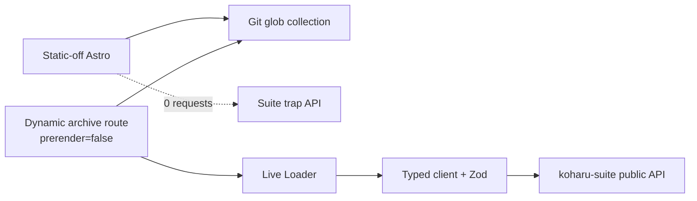

# G2.6 — 发布 `@koharu/astro-loader` 设计文档

> 作者：Codex ｜ 日期：2026-07-24 ｜ 状态：Approved ｜ Issue：[#28](https://github.com/cosZone/koharu-suite/issues/28)

## 1. 背景与问题（Context）

G2.5 已完成公开 current-revision 搜索与 RSS，但 Astro 消费端仍需手写 URL、响应类型与错误处理。
Roadmap 因此把 Live Loader、typed read client、Zod 合同、错误归一化、Astro fixture 和 npm 首发演练
收束为 G2.6；astro-koharu 的真实页面接入留给 G2.7 与跨仓 tracking issue
[`cosZone/astro-koharu#199`](https://github.com/cosZone/astro-koharu/issues/199)。

现有事实与约束如下：

- 公开频道、消息、媒体 DTO 已存在，但定义位于 private 的 `@koharu-suite/server`
  （`apps/server/src/messages/types.ts:86-126`），不能成为 npm consumer 的依赖。
- JSON 路由包含频道列表、频道消息分页、消息详情和搜索
  （`apps/server/src/app.ts:538-640`）；公开媒体与 RSS 是不同的 binary/XML 合同。
- 消息列表 cursor 是 opaque、与频道绑定的 keyset cursor
  （`apps/server/src/messages/repository.ts:654-693`）；Astro 6 `LiveLoader` 的 collection result
  只有 `entries` 与 `cacheHint`，不能携带 suite 的 `nextCursor`。
- 公开消息只有 `publishedAt` 与 `revision`，没有表示当前 revision 更新时间的 public `updatedAt`
  （`apps/server/src/messages/types.ts:106-120`），不能伪造 `cacheHint.lastModified`。
- 相对媒体 URL 由 suite server 生成，必须相对 suite origin 解析，而不是相对 Astro 页面 origin。
- astro-koharu 保持默认 static output 与现有 `glob()` collection；G2.6 不修改用户主仓，也不实现页面。

Astro 6 官方合同要求 Live Collection 在 `src/live.config.ts` 中通过 `defineLiveCollection()` 注册；
`LiveLoader` 实现 `loadCollection()` 与 `loadEntry()`，并在请求时返回 entry/error/cache hint。动态路由
仍由消费站点选择 Node、Vercel、Netlify 或其他支持 on-demand rendering 的 adapter。

## 2. 目标与非目标（Goals / Non-Goals）

### Goals

1. 发布 ESM-only `@koharu/astro-loader`，公开稳定的 typed client、Zod schemas 和 Astro 6 Live Loaders。
2. client 覆盖频道列表、频道消息分页、消息详情和消息搜索；所有 2xx JSON 都经过 Zod runtime parse。
3. 把 abort、timeout、network、HTTP/API error 与 invalid response 归一化为安全、可判别的错误。
4. Live Loader 适配频道集合、消息集合首屏和消息详情，并把 server 的安全 HTML 映射为
   `rendered.html`。
5. package import 无副作用：不读环境变量、不发请求、不注册 collection、不自动安装 deployment adapter。
6. 使用打包后的 npm tarball 验证最小 Astro consumer，以及从公开 astro-koharu template 创建的
   独立 static-off/dynamic-on checkout。
7. static-off 在 package 已安装且环境里故意存在 suite URL 时仍保持纯静态构建、零 suite 请求。
8. 建立 Changeset、tarball 内容审计、npm dry-run 与 owner 参与的首次公开发布门禁。

### Non-Goals

- 不在 G2.6 修改 astro-koharu 主仓、添加真实归档页面或决定其视觉/路由结构；这些属于 G2.7。
- 不实现 build-time article loader、Git/DB 双源合并或数据库文章发布；这些属于 M3。
- 不从 private server package 导出或复用 DTO，不公开 repository、cursor payload、Drizzle 或 grammY 类型。
- 不封装 RSS XML parser、binary media downloader、Admin/Better Auth/service-token API。
- 不自动扫描所有频道的所有页，不把 runtime Live Loader 伪装成增量同步器。
- 不捆绑 `@astrojs/node`，不把站点全局改为 `output: 'server'`。
- 不读取、提交或打印 `astro-koharu-private` 的正文、标题、URL、附件或 identity。
- 不自动执行不可逆 npm publish；最终 publish 必须经过 owner 明确确认。

## 3. 约束与假设（Constraints & Assumptions）

- 支持 `astro ^6.0.0`；fixture 固定到 astro-koharu `v5.0.0` 对应提交 `60e93bb`。
- package runtime 支持 Node.js `>=22.20.0`，使用原生 `fetch`、`AbortSignal` 与 ESM。
- schema 使用 Astro 6 的 `astro/zod` 公共入口（Zod 4）；公开 TypeScript 类型全部从 schemas
  推导，禁止重复手写同名 DTO，也禁止引入与 consumer Astro 不同版本的第二份 Zod。
- `baseUrl` 必须是 HTTP(S) canonical origin，无 credentials/path/query/hash；生产推荐 HTTPS，
  localhost 允许 HTTP。
- client 默认 timeout 为 5 秒，可在 1–30 秒范围配置；调用方的 abort signal 优先保留。
- JSON 请求默认 `cache: 'no-store'`；G2.6 不提供不准确的 Live Loader `lastModified`。
- Astro Live Loader 没有 arbitrary metadata channel；分页/search consumer 使用 typed client 获取
  `nextCursor`，不能从 `getLiveCollection()` 返回值中读取它。
- 默认定位为 Astro server/build runtime client。浏览器直接调用 suite API 时，部署者仍需配置
  `PUBLIC_CORS_ORIGINS`。
- npm package 以 `0.0.0` 进入 feature PR，由 minor Changeset 生成首个 `0.1.0`。
- 当前机器尚未登录 npm；权限与 publish 只在 tarball、PR、CI 全部通过后由 owner 操作。

## 4. 方案设计（Detailed Design）

### 4.1 Package 边界

```text
packages/astro-loader/
  src/
    client.ts
    errors.ts
    index.ts
    loaders.ts
    schemas.ts
    urls.ts
  test/
  package.json
  tsconfig.json
  tsconfig.build.json
```

公开 exports：

```json
{
  ".": "./dist/index.js",
  "./client": "./dist/client.js",
  "./loaders": "./dist/loaders.js",
  "./schemas": "./dist/schemas.js",
  "./package.json": "./package.json"
}
```

每个 JS export 都有对应 `types` 条件。package 以 `astro ^6.0.0` 为 peer dependency 和 dev
dependency，并从 `astro/zod` 建立 runtime contract；不得依赖第二份 `zod`、`@koharu-suite/server`
或 `@astrojs/node`。

### 4.2 Zod 合同

公开 schemas：

```ts
apiErrorResponseSchema
publicChannelSchema
publicMessageEntitySchema
publicMediaSchema
publicMessageSchema
channelListResponseSchema
messagePageSchema
searchMessageResultSchema
searchMessagePageSchema
```

关键语义：

- suite/channel/message/media ID 都验证为 UUID string，但保持普通 string 输出，避免 nominal type
  阻碍 Astro serialize。
- `publishedAt` 必须是 canonical UTC ISO string；`fileSize` 是 decimal string，不转换为 number。
- entity `type` 是非空开放 string，不能冻结成当前 Telegram enum。
- cursor 只暴露 `string | null`，不解析内部 JSON/hash/snapshot。
- error `code` 是非空开放 string；已知 code 可作为常量导出，但 schema 不使用 closed enum。
- relative media URL 允许 `/api/v1/media/...`，由 `resolveSuiteUrl()` 基于配置的 suite origin 解析。

server 的 HTTP contract test 直接用这些 schemas 验证真实 Hono response，防止 server 与 npm package
在同一 monorepo 内悄悄漂移；server runtime 不依赖 adapter。

### 4.3 Typed client

推荐公开 API：

```ts
const client = createKoharuClient({
  baseUrl: 'https://suite.example.com',
  timeoutMs: 5_000,
  fetch: globalThis.fetch,
});

await client.channels.list({ signal });
await client.messages.list({ channelId, limit, cursor, signal });
await client.messages.get({ messageId, signal });
await client.search.messages({
  query,
  channelId,
  from,
  to,
  sort,
  limit,
  cursor,
  signal,
});

client.resolveUrl(message.media[0]?.thumbnailUrl);
client.urls.globalRss();
client.urls.channelRss(channelId);
```

client 只生成 `GET` request。undefined query 不进入 URL；Date input 在 client 边界转为 canonical UTC。
用户传入 cursor 时原样 URL encode。response body 只读取一次并按下述顺序处理：

1. 非 2xx：尝试 parse `{ error: { code, message } }`，失败则使用 `http_<status>`。
2. 2xx：JSON parse 后由 endpoint schema `safeParse()`。
3. 429：保留有限的 `Retry-After`/`RateLimit-*` 数值，不保留任意 header。
4. 任何 error 都不得包含完整 response body、suite URL credentials 或用户内容。

### 4.4 错误模型

```ts
type KoharuErrorKind =
  | 'aborted'
  | 'timeout'
  | 'network'
  | 'http'
  | 'invalid_response';

class KoharuError extends Error {
  readonly kind: KoharuErrorKind;
  readonly status: number | null;
  readonly code: string | null;
  readonly retryAfterSeconds: number | null;
  readonly cause?: unknown;
}
```

- 调用方 signal abort → `aborted`。
- package timeout abort → `timeout`。
- fetch 其他异常 → `network`。
- 任何非 2xx → `http`；404 保留 server code，例如 `message_not_found`。
- 2xx 但 JSON/schema 不合法 → `invalid_response`。
- `isKoharuError()` 用于跨 package boundary 判别；Live Loader 返回该 error，不抛失真字符串。

### 4.5 Astro 6 Live Loaders

```ts
koharuChannelsLoader({ client | baseUrl, timeoutMs? })
koharuMessagesLoader({ client | baseUrl, timeoutMs? })
```

频道 loader：

- `loadCollection()` → `client.channels.list()`；
- `loadEntry({ filter: { id } })` → list 后按 suite channel UUID 查找；
- 不返回 `rendered`。

消息 loader：

- `loadCollection({ filter: { channelId, limit?, cursor? } })` → 一页消息；
- `loadEntry({ filter: { id } })` → 消息详情；
- `content.html !== null` 时返回 `{ rendered: { html } }`，不把 HTML 再当 Markdown 渲染；
- consumer 直接以 Astro `set:html` 输出 `entry.rendered.html`；不依赖 Astro 6.4.x 尚未为
  `LiveDataEntry` 声明的 `render(entry)` 类型重载；
- error 原样返回 `{ error: KoharuError }`；
- 不提供 `cacheHint.lastModified`。

Astro 6 collection result 无 `nextCursor`，所以 loader 的 cursor filter 只适合调用方已经持有 cursor 的请求。
需要展示“下一页”的 G2.7 route 必须调用 `client.messages.list()`，从其 page DTO 读取 `nextCursor`。
search 同理只属于 typed client，不伪造为 collection。

消费示例：

```ts
// src/live.config.ts
import { defineLiveCollection } from 'astro:content';
import {
  koharuChannelsLoader,
  koharuMessagesLoader,
  publicChannelSchema,
  publicMessageSchema,
} from '@koharu/astro-loader';

const baseUrl = process.env.KOHARU_SUITE_URL!;

export const collections = {
  koharuChannels: defineLiveCollection({
    loader: koharuChannelsLoader({ baseUrl }),
    schema: publicChannelSchema,
  }),
  koharuMessages: defineLiveCollection({
    loader: koharuMessagesLoader({ baseUrl }),
    schema: publicMessageSchema,
  }),
};
```

package 不提供读取 `process.env` 的 helper；feature flag、环境变量命名与 conditional import 属于 G2.7
消费端配置。

### 4.6 Static-off 与 Dynamic-on



static-off：

- tarball 已安装但不 import；
- 不存在 live config/动态 route；
- 即使 `KOHARU_SUITE_URL` 指向 trap server，`astro check` 与 `astro build` 请求数仍为 0；
- 没有 Node server output，既有 Git 文章继续生成静态 HTML。

dynamic-on：

- fixture 自己安装 `@astrojs/node` standalone adapter；
- 保持 Astro 默认 `output: 'static'`，仅 archive fixture route 设置 `prerender = false`；
- build 阶段 suite 请求数为 0；
- 启动 `dist/server/entry.mjs` 后，请求 archive route 才访问 suite；
- static page 不访问 suite；
- API 404、500、timeout、invalid response 都只让 archive route 显示降级，不终止进程；
- fixture 修改 revision 后的下一次 runtime request 能读取新 revision。

### 4.7 Fixture 隔离

快速 CI fixture 使用最小合成 Astro consumer。发布前 template smoke：

1. 固定 `https://github.com/cosZone/astro-koharu.git`、tag `v5.0.0`、commit `60e93bb`。
2. 在 `mktemp` 下创建两个独立 checkout；不得 clone/copy/worktree 用户主仓。
3. 安装 `pnpm pack` 生成的 `.tgz`，不得用 `workspace:*` 代替 package artifact。
4. 使用 `node:http` 合成 suite API；不运行真实 Telegram/PostgreSQL。
5. CI 不读取 `astro-koharu-private`。G2.7 若做本地 fidelity smoke，只能临时复制最小片段且不得
   进入 git、日志或 snapshot。

### 4.8 npm 首发链

package metadata：

- `name: "@koharu/astro-loader"`；
- `version: "0.0.0"` + minor Changeset；
- `license: "AGPL-3.0-only"`；
- `publishConfig.access: "public"`、`publishConfig.provenance: true`；
- `files` 只包含 `dist`、README、LICENSE；
- `repository.directory` 指向 `packages/astro-loader`；
- `sideEffects: false`。

feature PR/CI 必须完成：

1. build/typecheck/unit/contract/fixture；
2. `pnpm pack`；
3. tarball manifest 与敏感词检查；
4. 在临时 consumer 从 `.tgz` 安装；
5. `npm publish --dry-run --access public`。

合并后 Changesets Version Packages PR 把 package 提升到 `0.1.0`。首次 publish 是 owner checkpoint：

1. owner 登录 npm、确认属于 `@koharu` organization 且 2FA 可用；
2. 再次核对 tarball digest、version、public access 与 registry；
3. owner 明确确认后执行首次公开发布；
4. package 存在后，在 npm package settings 配置 GitHub Actions trusted publisher；
5. 后续 workflow 使用 GitHub-hosted runner、`id-token: write` 和 npm CLI `>=11.15.0`，不保存长期 token。

若 npm 组织权限、2FA 或 registry ownership 不能确认，Goal 保持未完成；不得换包名、个人 scope 或
跳过 public access 自行发布。

## 5. 备选方案与权衡（Alternatives Considered）

| 方案 | 优点 | 代价 / 风险 | 是否采用 |
|---|---|---|---|
| Typed client + schemas + 两个 Live Loaders | 符合 Astro 6、错误与 DTO 单一、G2.7 可组合 | loader 不能承载 nextCursor | 采用 |
| 只发布 typed client | API 最窄、分页完整 | 未交付 Roadmap 要求的 Live Loader | 不采用 |
| Live Loader 每次完整扫描所有频道/页面 | consumer 看似简单 | SSR 慢、触发限流、失败时语义不清 | 不采用 |
| 使用 build-time `Loader`/store 同步 | 可持久缓存和删除对账 | 不满足 Live Content/runtime edit 目标 | 留给未来文章 loader |
| package 自动读 env/注册 collection | consumer 代码少 | import 有副作用，破坏 static-off | 不采用 |
| package 依赖 `@astrojs/node` | fixture 简单 | 锁死部署平台、改变 consumer output | 不采用 |
| 从 private server package 导入 DTO | 初期少写 schema | npm 无法消费、无 runtime validation | 不采用 |
| 封装 binary media fetch | API 看似完整 | Range/304/stream 扩大首版 surface | 不采用；只解析 URL |

若 Astro 未来为 Live Collection result 增加 typed metadata，或 suite 新增 snapshot/changes API，
可再评估 loader pagination/增量语义；首版不预先伪造。

## 6. 横切关注点（Cross-cutting Concerns）

- **安全/隐私**：只访问公开 `/api/v1`；禁止 auth token；错误不带 response body；fixture 全合成。
- **性能**：一条 loader 调用对应至多一条 JSON API request；不自动翻页、不重试风暴。
- **缓存**：JSON 默认 no-store；无 public updatedAt 时不提供虚假 lastModified。
- **可观测性**：`KoharuError` 保留 kind/status/code/retry-after；不加入 telemetry。
- **兼容性**：ESM、Node 22、Astro 6、Zod 4；cursor 永远 opaque。
- **供应链**：公开 tarball allowlist、provenance、2FA 首发、后续 OIDC trusted publishing。

## 7. 影响面与风险（Impact & Risks）

- 新增公开 npm API 后，命名与 DTO 兼容性受 SemVer 约束；首版应保持 surface 小。
- server DTO 与 loader package schema 是两个源码位置；通过真实 Hono response contract test 缓解漂移。
- Live Loader 不返回 nextCursor，文档若不明确会诱导 consumer 构造不可用分页。
- template smoke 依赖远端公开 tag；固定 commit 并把全量 smoke 与快速 unit test 分层。
- scoped package 默认 private；漏掉 public access 会让首发失败或产生错误可见性预期。
- 首发 npm 版本不可覆盖；发现 P0 时发布新 patch/deprecate，禁止尝试重写版本。

## 8. 上线与回滚（Rollout & Migration）

1. feature PR 发布 `0.0.0` package source 与 minor Changeset，不执行 npm publish。
2. CI/PR 验证 tarball、minimal fixture 与 pinned template smoke。
3. squash merge；Version Packages PR 生成并合并 `0.1.0`。
4. owner 完成 npm 首发 checkpoint。
5. 从 registry 新建临时 consumer，安装精确 `@koharu/astro-loader@0.1.0` 再跑一次 smoke。
6. 配置 trusted publisher，后续版本改由受保护 workflow 发布。

回滚：

- 未启用 consumer 无需动作，静态站没有 loader runtime。
- 已启用 consumer 可 pin 旧版本或移除 live config/route，恢复 static-only。
- npm 已发布版本不覆盖、不依赖 unpublish；P0 使用 deprecate + 修复版本。
- G2.6 不修改数据库/API schema，无数据库迁移或数据回滚。

## 9. 测试策略（Testing）

### Unit

- 每个 schema 的合法/缺失/额外/错误类型/开放 code/entity type。
- canonical origin、query encode、relative media URL、timeout 与 caller abort。
- 200 invalid JSON/schema drift；400/404/429 JSON error；500 HTML error。
- loader collection/entry/error/rendered HTML/no false cacheHint。

### Contract

- 真实 Hono app 的 channels/messages/detail/search response 由 package schemas parse。
- tombstone/edited current revision、media relative URL、decimal fileSize 保持合同。

### Artifact

- `pnpm pack` contents 只含 allowlist；
- consumer 从 `.tgz` 安装并 import root/subpaths；
- declarations 无 private workspace import；
- `npm publish --dry-run --access public`。

### Astro E2E

- minimal static-off：0 suite requests、静态 output。
- minimal dynamic-on：production Node entry、runtime fetch、404/unavailable 降级。
- template static-off/dynamic-on：固定公开 template checkout，绝不接触用户主仓。

### Workspace gates

```bash
pnpm lint
pnpm typecheck
pnpm test
pnpm test:integration
pnpm build
pnpm build:storybook
pnpm test:storybook
pnpm test:astro
pnpm pack:astro-loader
```

## 10. 待决问题（Open Questions）

1. 首次 npm 发布时，以 owner 交互式 2FA 直接发布作为 bootstrap，随后配置 OIDC；若 npm 当时已允许
   new package 通过 staged publishing 安全 bootstrap，则在发布 checkpoint 再以官方实时文档为准。

## 11. 参考（References）

- Roadmap：<https://github.com/cosZone/koharu-suite/issues/1>
- Astro consumer tracking：<https://github.com/cosZone/astro-koharu/issues/199>
- Astro Live Loader：<https://docs.astro.build/en/reference/content-loader-reference/>
- Astro on-demand rendering：<https://docs.astro.build/en/guides/on-demand-rendering/>
- npm scoped public packages：<https://docs.npmjs.com/creating-and-publishing-scoped-public-packages/>
- npm trusted publishers：<https://docs.npmjs.com/trusted-publishers/>
- 现有公开 DTO：`apps/server/src/messages/types.ts:86-126`
- 现有公开路由：`apps/server/src/app.ts:538-675`
- 当前 Changesets 配置：`.changeset/config.json:1-15`
